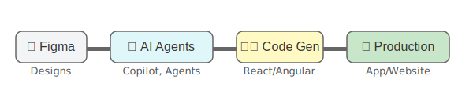

# 🎨 Design-to-Code Playbook

<p align="center">
  <strong>Design-to-Code High-Level Process</strong>
</p>
<p align="center">
  
</p>

## About

The Design-to-Code Playbook is a comprehensive, practical guide for transforming Figma designs into production-ready code. Created for developers, designers, and teams working at the intersection of design and development, this playbook bridges the gap between visual design and implementation.

### What is this playbook?

This playbook provides a structured, step-by-step approach to converting Figma designs into high-quality code using modern tools like VS Code, GitHub Copilot, and Azure AI. Rather than just theoretical concepts, it offers practical workflows, code examples, and hands-on exercises to build real-world components and applications.

### Who is it for?

- **Frontend Developers** looking to streamline their design-to-code workflow
- **UI/UX Designers** wanting to understand how their designs translate to code
- **Full-Stack Developers** expanding their frontend skills
- **Technical Leads** seeking to establish design system implementation practices
- **Teams** aiming to improve collaboration between design and development

### What's included?

- 📚 **Comprehensive documentation** covering the entire design-to-code process
- 🧩 **Framework-specific implementation guides** for React, Angular, and more
- 🧪 **Hands-on workshops** (1-hour demo and 3-hour deep dive)
- 🔧 **Practical code examples** and component implementations
- 🛠️ **Best practices** for accessibility, performance, and maintainability
- 🤖 **AI-assisted workflows** leveraging GitHub Copilot and Azure AI
- 🧠 **Troubleshooting guides** and common pitfall solutions

### How to use this playbook

This repository is structured as a learning journey. Start with the fundamentals in the documentation section, then explore the framework-specific guides that match your tech stack. When you're ready for hands-on practice, follow the 1-hour demo session or dive deeper with the 3-hour workshop.

## 📋 Overview

The Design-to-Code Playbook is a structured, educational resource that provides a complete workflow for transforming Figma designs into high-quality, accessible, and maintainable code. This playbook covers everything from environment setup to advanced optimization techniques, with practical examples and hands-on exercises.

## 🎯 Who This Playbook Is For

- **Frontend Developers** looking to streamline their design-to-code workflow
- **UI/UX Designers** wanting to understand the development implementation process
- **Full-Stack Developers** expanding their frontend skills
- **Technical Leads** seeking to establish best practices for their teams
- **Students and Beginners** learning modern frontend development practices

## 📚 What You'll Learn

- Setting up a complete development environment
- Analyzing and preparing Figma designs for conversion
- Using GitHub Copilot to accelerate development
- Leveraging Azure AI for enhanced design analysis
- Implementing components in React and Angular
- Creating and maintaining a component library
- Testing and quality assurance best practices
- Automating workflows with GitHub Actions
- Optimizing for performance, accessibility, and maintainability
- Troubleshooting common issues in the design-to-code process

## 📖 Table of Contents

### Core Playbook Content

1. [Setting Up Your Development Environment](docs/01-environment/README.md)
2. [Preparing Figma Designs for Optimal Conversion](docs/02-figma-prep/README.md)
3. [Using GitHub Copilot for Code Generation](docs/03-copilot/README.md)
4. [Integrating with Azure AI Foundry](docs/04-azure-ai/README.md)
5. [Framework Implementation: React](docs/05-react/README.md)
6. [Framework Implementation: Angular](docs/06-angular/README.md)
7. [Component Library Implementation](docs/07-component-library/README.md)
8. [Testing and Quality Assurance](docs/08-testing/README.md)
9. [Workflow Automation with GitHub Actions](docs/09-github-actions/README.md)
10. [Workshop Guides: Hands-on Practice](docs/10-workshops/README.md)
11. [Best Practices and Optimization Techniques](docs/11-best-practices/README.md)
12. [Troubleshooting Guide](docs/12-troubleshooting/README.md)
13. [References and Resources](docs/13-resources/README.md)

### Hands-On Learning

- [1-Hour Demo Session](demos/01-hour-session/README.md) - A concise demonstration of the design-to-code workflow
- [3-Hour Workshop](workshops/03-hour-workshop/README.md) - A comprehensive hands-on workshop for deep learning

## 🚀 Getting Started

### Prerequisites

- Basic understanding of HTML, CSS, and JavaScript
- Familiarity with React or Angular concepts
- GitHub account (for Copilot access)
- Figma account (free tier is sufficient to start)
- VS Code installed on your computer

### Quick Start

1. Clone this repository:
   ```bash
   git clone https://github.com/yourusername/design-to-code-playbook.git
   cd design-to-code-playbook
   ```

2. Start by reading the [Setting Up Your Development Environment](docs/01-environment/README.md) guide.

3. Progress through the playbook sections in order, or jump to specific topics based on your needs.

4. For hands-on practice:
   - Try the [1-Hour Demo Session](demos/01-hour-session/README.md) for a quick overview
   - Complete the [3-Hour Workshop](workshops/03-hour-workshop/README.md) for deep learning

## 🤝 Contributing

We welcome contributions to improve this playbook! Please see our [CONTRIBUTING.md](CONTRIBUTING.md) file for guidelines.

## 📄 License

This playbook is available under the [MIT License](LICENSE).

## 🙏 Acknowledgements

- The GitHub Copilot team for their revolutionary AI tool
- The Microsoft Azure AI team for their powerful AI services
- The Figma team for creating an exceptional design tool
- All contributors and reviewers who helped shape this playbook

## 👤 Credits

This Design-to-Code Playbook was developed by [@paulanunes85](https://github.com/paulanunes85).