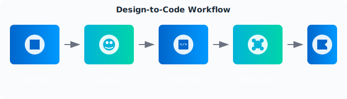
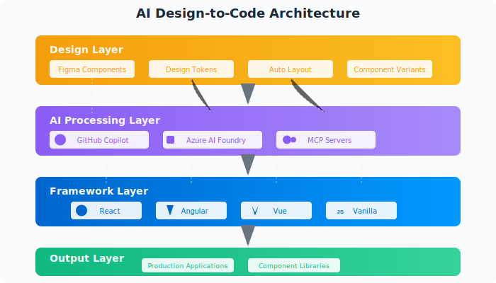

# 🚀 Design to Code with AI

Welcome to the **Design to Code** Workshop! This hands-on workshop guides you through implementing comprehensive design-to-code solutions using Figma, GitHub Copilot, and Azure AI Foundry for modern UI development.

[](https://design-to-code.dev) [](https://github.com/paulasilvatech/Design-to-Code-Dev/stargazers) [](LICENSE)

## Design-to-Code Workflow - AI-Powered Implementation

<div align="center">
  
</div>

## 🌐 Official Workshop Website: [design-to-code.dev](https://design-to-code.dev)

## 📖 The Journey to AI-Enhanced Design-to-Code

Welcome to the Design-to-Code Enterprise Workshop! This repository takes you on a transformative journey from traditional manual design interpretation to the world of AI-assisted design-to-code workflows and automated component generation.

As a developer in today's fast-paced design-driven environment, you face a critical challenge: **most of your time isn't spent creating new features**. According to industry studies:

- Traditional design-to-code approaches require extensive manual interpretation
- High inconsistency leads to design system drift and maintenance overhead
- Difficult to maintain design fidelity across multiple frameworks
- Reactive bug fixing instead of proactive component optimization

This workshop provides hands-on guidance to implement modern design-to-code workflows using AI-powered tools. We'll demonstrate how GitHub Copilot, Figma API, and Azure AI Foundry can transform your frontend development strategy.

> *"Design-to-code is not about replacing designers or developers, but about amplifying their abilities to create consistent, accessible, and maintainable user interfaces faster than ever before."*

## ⭐ Business Impact

Organizations implementing comprehensive design-to-code automation report significant benefits:

- **Faster Development Cycles**: Reduce component development time from days to hours
- **Design System Consistency**: Maintain 99% design fidelity across implementations
- **Reduced Technical Debt**: 70% reduction in design-related bugs and inconsistencies
- **Cross-Framework Efficiency**: Generate components for multiple frameworks simultaneously
- **Team Productivity**: Shift from 60% manual coding to 70% strategic feature development

Advanced design-to-code workflows enable progression through four maturity stages:

1. **Manual**: Traditional design interpretation and hand-coding
2. **Assisted**: AI-powered code generation with manual refinement
3. **Automated**: Full design system synchronization and component generation
4. **Intelligent**: Self-optimizing components with performance and accessibility enhancements

<div align="center">
  
</div>

## 📋 Workshop Structure

The workshop is organized into progressive modules, allowing you to choose the depth of coverage based on your time and experience:

| Level         | Duration | Focus                           | Best For                               |
| ------------- | -------- | ------------------------------- | -------------------------------------- |
| **Basic**     | 90 min   | Core concepts and first component | Beginners, quick introductions         |
| **Intermediate** | 2-3 hours | Complete component library     | Standard workshops, team training      |
| **Advanced**  | 6+ hours | Enterprise-scale implementation | Experienced practitioners, deep dives  |

## 🗺️ Learning Path

### Module 1: [Introduction to Design-to-Code Technologies](docs/intro-design-to-code.md#-what-is-design-to-code)

- Foundation concepts and modern workflow paradigms
- The design-to-code pipeline: Figma → AI → Framework → Production
- Tools ecosystem overview and integration strategies

### Module 2: [Environment Setup & Basics](docs/design-to-code-workshop-part-01.md#-pre-workshop-preparation)

- Workshop preparation and tool configuration
- Creating your first AI-generated component
- Exploring Figma Dev Mode fundamentals

### Module 3: [Figma Analysis & Component Extraction](docs/design-to-code-workshop-part-02.md#-module-3-github-copilot-for-component-generation-20-minutes)

- Advanced design analysis techniques
- Component structure identification
- Design token extraction and management

### Module 4: [AI-Powered Code Generation](docs/design-to-code-workshop-part-03.md#-intermediate-workshop-overview)

- GitHub Copilot optimization for component development
- Custom prompt engineering for design systems
- Advanced code generation patterns

### Module 5: [Design System Implementation](docs/design-to-code-workshop-part-04.md#-advanced-workshop-overview)

- Automated design token synchronization
- Cross-framework component architecture
- Scalable design system patterns

### Module 6: [Advanced Component Patterns](docs/design-to-code-workshop-part-05.md#-module-5-overview)

- Complex interaction implementations
- State management integration
- Performance optimization techniques

### Module 7: [Responsive Design & Accessibility](docs/design-to-code-workshop-part-06.md#-module-6-overview)

- Mobile-first responsive generation
- WCAG compliance automation
- Cross-device testing strategies

### Module 8: [Testing & Quality Assurance](docs/design-to-code-workshop-part-07.md#-enterprise-design-system-orchestration)

- Visual regression testing setup
- Component testing automation
- Performance monitoring implementation

### Module 9: [Production Deployment & Optimization](docs/design-to-code-workshop-part-08.md#-complete-integration-and-challenge-lab)

- CI/CD pipeline integration
- Component library publishing
- Performance optimization in production

### [Advanced Troubleshooting Guide](docs/advanced-troubleshooting-guide.md#-ai-tool-troubleshooting)

- Common issues and solutions
- Advanced debugging techniques
- Performance optimization strategies

## 🔑 Prerequisites

### Required Accounts

- Create [Azure Free Account](https://go.microsoft.com/fwlink/?linkid=859151)
- Azure AI Foundry (Free tier available)
- GitHub account with [GitHub Copilot Free](https://code.visualstudio.com/docs/copilot/setup-simplified)
- Create [Figma Free Account](https://www.figma.com/signup?locale=en-us)
- Download [VS Code](https://visualstudio.microsoft.com/downloads/)

### Technical Requirements

- Development environment: VS Code, Node.js 18+, Git
- Basic understanding of HTML, CSS, and JavaScript
- Familiarity with component-based frameworks (React, Angular, or Vue)

## 🛠️ Getting Started

1. **Fork and Clone this Repository**
   ```bash
   git clone https://github.com/YourUsername/Design-to-Code-Dev.git
   cd Design-to-Code-Dev
   ```

2. **Quick Start (30 minutes)**
   - Follow our [Quick Start Guide](docs/QUICK_START.md) for immediate hands-on experience
   - Complete setup verification and first component generation

3. **Follow the Workshop Structure**
   - Start with [Introduction to Design-to-Code Technologies](docs/intro-design-to-code.md)
   - Progress through modules based on your experience level
   - Use the [Advanced Troubleshooting Guide](docs/advanced-troubleshooting-guide.md) if needed

4. **🚀 Try the Extra Module**
   - Check out the **[Extra Module: Practical Demo](practical-demo/README.md)** for hands-on exercises
   - Includes complete landing page, React components, and automation scripts
   - Perfect for applying what you've learned in a real-world context

## 🌟 Key Features

- **AI-Enhanced Development**: Learn to implement GitHub Copilot for intelligent component generation
- **Multi-Framework Support**: Build unified components for React, Angular, Vue, and vanilla JavaScript
- **Real-World Scenarios**: Practice with authentic enterprise design system challenges
- **Progressive Learning**: Start from basics and advance to enterprise-scale solutions
- **Figma Integration**: Master Figma API and Dev Mode for seamless design-to-code workflows

## 🔗 Related Repositories

### [Design-to-Code](https://github.com/paulasilvatech/Design-to-Code-Dev)
A comprehensive guide for transforming Figma designs into production-ready code. This playbook provides a structured approach to converting design assets into high-quality, accessible, and maintainable code with practical workflows, code examples, and hands-on exercises using modern tools like VS Code, GitHub Copilot, and Azure AI.

### [AI Code Development](https://github.com/paulasilvatech/Code-AI-Dev)
A complete guide for leveraging AI tools like GitHub Copilot to optimize and improve code quality in enterprise environments. This repository covers advanced AI-assisted workflows, refactoring techniques, code optimization strategies, and best practices for integrating AI tools into your development process.

### [Agentic Operations & Observability](https://github.com/paulasilvatech/Agentic-Ops-Dev)
A hands-on workshop for implementing comprehensive observability solutions for cloud applications using Azure Monitor, Application Insights, and AI-powered tools like Azure SRE Agent. This repository guides you through the journey from traditional monitoring to AI-enhanced observability, covering the three pillars (metrics, logs, traces), multi-cloud integration, and agentic DevOps practices.

## 👤 Credits

This Design to Code Workshop was developed by [Paula Silva](https://github.com/paulasilvatech), Developer Productivity [Global Black Belt at Microsoft Americas](https://www.linkedin.com/in/paulanunes/).focusing on bridging the gap between design and development through AI-powered automation. The workshop provides a comprehensive approach to implementing modern design-to-code workflows for enterprise software applications.

