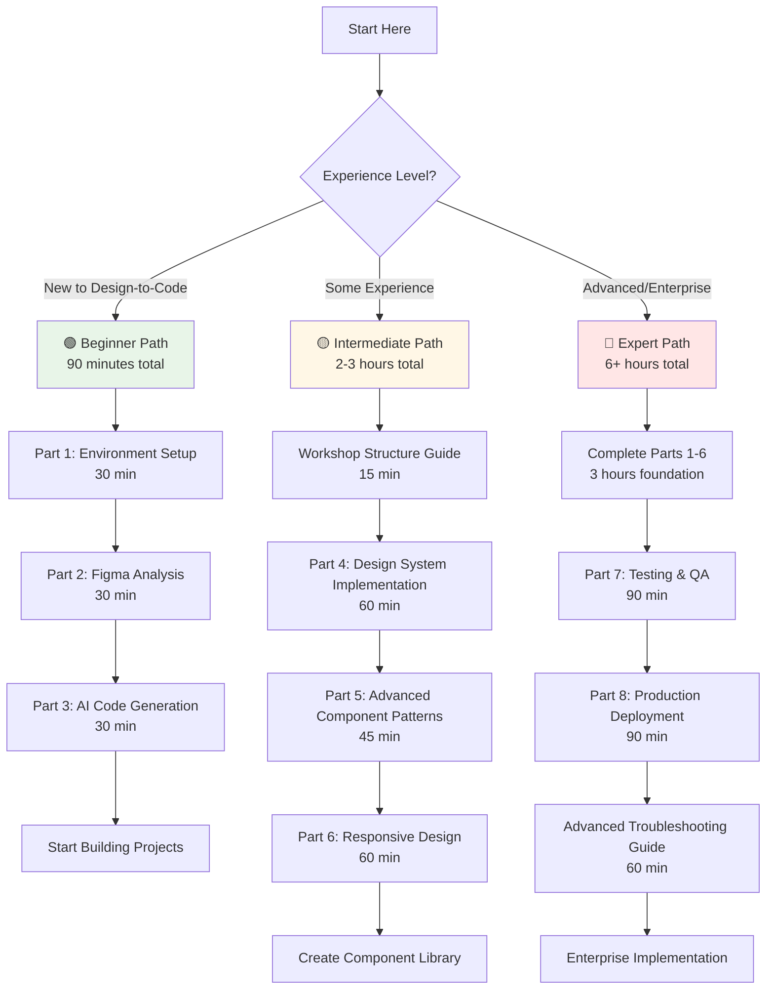

# 🚀 Quick Start Guide

Get up and running with the Design-to-Code Enterprise Playbook in under 30 minutes!

[](LICENSE)
[](#)
[](#)

## 📋 Prerequisites Checklist

Before you begin, make sure you have:

- [ ] **GitHub account** with Copilot access ([Get Copilot](https://github.com/features/copilot))
- [ ] **Figma account** ([Sign up free](https://figma.com))
- [ ] **Node.js 18+** installed ([Download](https://nodejs.org))
- [ ] **VS Code** or preferred IDE ([Download](https://code.visualstudio.com))
- [ ] Basic knowledge of HTML, CSS, and JavaScript

## ⚡ 15-Minute Quick Demo

### Step 1: Clone and Setup (3 minutes)

```bash
git clone https://github.com/paulasilvatech/Design-to-Code-Dev.git
cd Design-to-Code-Dev
```

### Step 2: Read Foundation (5 minutes)

Quickly scan these essential sections:
- [Introduction to Design-to-Code Technologies](intro-design-to-code.md#what-is-design-to-code) (2 min)
- [Core Technologies Overview](intro-design-to-code.md#core-technologies-overview) (3 min)

### Step 3: Try Your First Conversion (7 minutes)

Follow the [Part 1: Environment Setup & Basics](design-to-code-workshop-part-01.md) guide to:
- Set up GitHub Copilot
- Create your first Figma-to-React component
- See AI-powered code generation in action

## 🎯 Choose Your Learning Path

Based on your experience and available time:



### 🟢 New to Design-to-Code (90 minutes total)
1. Start with [Part 1: Environment Setup](design-to-code-workshop-part-01.md) (30 min)
2. Continue to [Part 2: Figma Analysis](design-to-code-workshop-part-02.md) (30 min)
3. Try [Part 3: AI Code Generation](design-to-code-workshop-part-03.md) (30 min)

### 🟡 Some Experience (2-3 hours total)
1. Review [Workshop Structure Guide](workshop-structure-guide.md) (15 min)
2. Jump to [Part 4: Design System Implementation](design-to-code-workshop-part-04.md) (60 min)
3. Explore [Part 5: Advanced Component Patterns](design-to-code-workshop-part-05.md) (45 min)
4. Practice with [Part 6: Responsive Design](design-to-code-workshop-part-06.md) (60 min)

### 🔴 Advanced/Enterprise (6+ hours total)
1. Complete Parts 1-6 as foundation (3 hours)
2. Deep dive into [Part 7: Testing & QA](design-to-code-workshop-part-07.md) (90 min)
3. Master [Part 8: Production Deployment](design-to-code-workshop-part-08.md) (90 min)
4. Review [Advanced Troubleshooting Guide](advanced-troubleshooting-guide.md) (60 min)

## 🛠️ Essential Tools Setup

### 🤖 GitHub Copilot
```bash
# Install VS Code extension
code --install-extension GitHub.copilot
```

### 🎨 Figma Dev Mode
1. Open any Figma file
2. Click "Dev Mode" in top-right
3. Explore component inspection features

### ⚛️ React Development Environment
```bash
# Create new React app
npx create-react-app my-design-system
cd my-design-system
npm start
```

## 🎨 Sample Design Files

To practice with real designs, use these Figma community files:

- **Beginner**: [Material Design Components](https://www.figma.com/community/file/778763161265841481)
- **Intermediate**: [Ant Design System](https://www.figma.com/community/file/831698976089873405)
- **Advanced**: [Apple Design Resources](https://www.figma.com/community/file/858143367356468985)

## 🚨 Common First-Time Issues

### 🤖 GitHub Copilot Not Working
```bash
# Check Copilot status
code --list-extensions | grep copilot

# Sign in to GitHub
gh auth login
```

### 🎨 Figma Access Issues
- Ensure you're logged into Figma
- Check file permissions (view or edit access needed)
- Try opening files in incognito mode

### 📦 Node.js Version Issues
```bash
# Check Node version
node --version

# Should be 18.0.0 or higher
# Use nvm to manage Node versions if needed
```

## 📚 Key Concepts to Understand

### 🎯 Design Tokens
Values that represent design decisions (colors, spacing, typography):
```css
:root {
  --color-primary: #0066cc;
  --spacing-sm: 0.5rem;
  --font-size-lg: 1.25rem;
}
```

### 🧩 Component-Based Architecture
Building UIs from reusable, isolated components:
```jsx
// Atomic component
const Button = ({ variant, children }) => (
  <button className={`btn btn--${variant}`}>
    {children}
  </button>
);
```

### 📐 Figma Auto Layout → CSS Flexbox

| Figma Property | CSS Property | Description |
|---|---|---|
| **Direction** | `flex-direction` | Controls layout direction (row/column) |
| **Spacing** | `gap` | Sets space between items |
| **Padding** | `padding` | Internal spacing |
| **Alignment** | `align-items`, `justify-content` | Controls item positioning |

## 🎯 Success Metrics

After completing the quick start, you should be able to:

- [ ] Extract design properties from Figma
- [ ] Generate basic React components with Copilot
- [ ] Apply design tokens in code
- [ ] Create responsive layouts
- [ ] Understand the design-to-code workflow

## 🆘 Need Help?

| Support Type | Resource | Best For |
|---|---|---|
| 🚨 **Immediate Help** | [Troubleshooting Guide](advanced-troubleshooting-guide.md) | Quick fixes and common issues |
| 🔍 **Search Issues** | [GitHub Issues](https://github.com/paulasilvatech/Design-to-Code-Dev/issues) | Known problems and solutions |
| 💬 **Community** | [GitHub Discussions](https://github.com/paulasilvatech/Design-to-Code-Dev/discussions) | Questions and collaboration |
| 🏢 **Enterprise** | [@paulasilvatech](https://github.com/paulasilvatech) | Custom training and implementation |
| 🆕 **Report Bug** | [New Issue](https://github.com/paulasilvatech/Design-to-Code-Dev/issues/new) | Bug reports and feature requests |

## 🎉 What's Next?

Once you've completed the quick start:

1. **Build a Complete Component Library** following Parts 4-6
2. **Implement Testing Strategies** from Part 7
3. **Set Up Production Deployment** with Part 8
4. **Contribute Back** to the community via [GitHub Issues](https://github.com/paulasilvatech/Design-to-Code-Dev/issues)

---

<div align="center">
  <strong>Ready to revolutionize your design-to-code workflow?</strong><br>
  <a href="intro-design-to-code.md">Start with the Full Introduction →</a>
</div>

---

## 🧭 Navigation

| Previous | Up | Next |
|----------|----|----- |
| [📖 Main README](../README.md) | [🏗️ Workshop Structure](workshop-structure-guide.md) | [🚀 Start Learning: Introduction](intro-design-to-code.md) |

**Ready to Begin?**: [📚 Read Introduction](intro-design-to-code.md) • [🚀 Jump to Part 1](design-to-code-workshop-part-01.md) • [🛠️ Need Help?](advanced-troubleshooting-guide.md) 