# 📚 Documentation Directory

Welcome to the comprehensive documentation for the **Design-to-Code Enterprise Workshop**! This directory contains all the guides, tutorials, and reference materials you need to master AI-powered design-to-code workflows.

## 📋 Table of Contents

- [Quick Navigation](#-quick-navigation)
- [Learning Path](#-learning-path)
- [Workshop Modules](#-workshop-modules)
- [Reference Guides](#-reference-guides)
- [Getting Started](#-getting-started)
- [Contributing](#-contributing)

## 🚀 Quick Navigation

| Document | Description | Duration | Level |
|----------|-------------|----------|--------|
| **[Quick Start Guide](QUICK_START.md)** | Get running in 30 minutes | 30 min | Beginner |
| **[Introduction](intro-design-to-code.md)** | Core concepts and technologies | 15 min | All levels |
| **[Workshop Structure](workshop-structure-guide.md)** | Complete workshop overview | 10 min | All levels |
| **[Troubleshooting](advanced-troubleshooting-guide.md)** | Solutions for common issues | Reference | Expert |

## 🎯 Learning Path

### For Beginners (90 minutes total)
1. **[Quick Start Guide](QUICK_START.md)** - Essential setup and first steps
2. **[Module 1: Environment Setup](design-to-code-workshop-part-01.md)** - Complete foundation
3. **[Module 2: Basic Implementation](design-to-code-workshop-part-02.md)** - First components

### For Intermediate Users (2-3 hours total)
1. **[Module 3: Advanced Figma](design-to-code-workshop-part-03.md)** - Complex components
2. **[Module 4: Design Systems](design-to-code-workshop-part-04.md)** - Scalable architecture
3. **[Module 5: Azure AI Integration](design-to-code-workshop-part-05.md)** - AI-powered analysis

### For Advanced Users (6+ hours total)
1. **Complete Modules 1-5** as foundation
2. **[Module 6: Multi-Modal AI](design-to-code-workshop-part-06.md)** - Advanced AI implementation
3. **[Module 7: Enterprise Orchestration](design-to-code-workshop-part-07.md)** - Large-scale systems
4. **[Module 8: Production Deployment](design-to-code-workshop-part-08.md)** - Complete integration

## 🏗️ Workshop Modules

### Foundation Series
| Module | Focus | Time | Key Technologies |
|--------|-------|------|------------------|
| **[Module 1](design-to-code-workshop-part-01.md)** | Environment Setup & Basics | 90 min | Figma, VS Code, GitHub Copilot |
| **[Module 2](design-to-code-workshop-part-02.md)** | Component Generation | 60 min | React, TypeScript, AI assistance |

### Intermediate Series
| Module | Focus | Time | Key Technologies |
|--------|-------|------|------------------|
| **[Module 3](design-to-code-workshop-part-03.md)** | Advanced Figma & Libraries | 2 hours | Auto Layout, Component Systems |
| **[Module 4](design-to-code-workshop-part-04.md)** | MCP Server & Automation | 3 hours | Model Context Protocol, GitHub Actions |
| **[Module 5](design-to-code-workshop-part-05.md)** | Azure AI Foundry Setup | 3 hours | Azure AI, Computer Vision, OpenAI |

### Advanced Series
| Module | Focus | Time | Key Technologies |
|--------|-------|------|------------------|
| **[Module 6](design-to-code-workshop-part-06.md)** | Multi-Modal AI Analysis | 3 hours | Azure CV, Form Recognizer, Custom Models |
| **[Module 7](design-to-code-workshop-part-07.md)** | Enterprise Orchestration | 3 hours | Workflow Automation, Governance |
| **[Module 8](design-to-code-workshop-part-08.md)** | Production Integration | 3 hours | CI/CD, Monitoring, Deployment |

## 📖 Reference Guides

### Core Concepts
- **[Introduction to Design-to-Code](intro-design-to-code.md)** - Foundation concepts and modern workflows
- **[Workshop Structure Guide](workshop-structure-guide.md)** - Complete curriculum overview

### Quick Reference
- **[Quick Start Guide](QUICK_START.md)** - 30-minute setup and demo
- **[Advanced Troubleshooting](advanced-troubleshooting-guide.md)** - Expert-level problem solving

### Technology Deep Dives
Each workshop module contains detailed sections on:
- **Figma Integration** - Dev Mode, Auto Layout, Component Systems
- **GitHub Copilot** - Prompt engineering, context optimization
- **Azure AI Services** - Computer Vision, Form Recognizer, OpenAI
- **Framework Implementation** - React, Angular, Vue component generation
- **Enterprise Patterns** - Scalability, governance, automation

## 🚀 Getting Started

### 1. Choose Your Path

```mermaid
graph TD
    A[Start Here] --> B{Experience Level?}
    
    B -->|New to Design-to-Code| C[🟢 Beginner Path<br/>Start with Quick Start]
    B -->|Some Experience| D[🟡 Intermediate Path<br/>Jump to Module 3]
    B -->|Advanced/Enterprise| E[🔴 Expert Path<br/>Complete Series]
    
    C --> F[Quick Start Guide]
    D --> G[Module 3: Advanced Figma]
    E --> H[Module 6: Multi-Modal AI]
```

### 2. Prerequisites
- **GitHub account** with Copilot access
- **Figma account** (free tier acceptable)
- **Node.js 18+** and **VS Code**
- **Basic knowledge** of HTML, CSS, JavaScript

### 3. Estimated Time Investment
- **Quick Demo**: 30 minutes
- **Basic Workshop**: 90 minutes
- **Complete Intermediate**: 2-3 hours
- **Full Advanced Series**: 6+ hours

## 📊 Workshop Success Metrics

After completing the workshops, you should be able to:

### Basic Level ✅
- [ ] Extract design properties from Figma
- [ ] Generate React components with GitHub Copilot
- [ ] Apply design tokens in code
- [ ] Create responsive layouts

### Intermediate Level ✅
- [ ] Build complete component libraries
- [ ] Implement automated design token sync
- [ ] Create cross-framework components
- [ ] Set up CI/CD for design systems

### Advanced Level ✅
- [ ] Deploy enterprise-scale design systems
- [ ] Implement AI-powered design analysis
- [ ] Create automated governance workflows
- [ ] Build production-ready integrations

## 🛠️ Tools & Technologies Covered

### Design Tools
- **Figma** - Design creation and developer handoff
- **Figma Dev Mode** - Code extraction and inspection
- **Design Tokens** - Systematic design values

### AI & Automation
- **GitHub Copilot** - AI pair programming
- **Azure AI Foundry** - Advanced AI services
- **MCP Server** - Model Context Protocol
- **GitHub Actions** - Automated workflows

### Development Frameworks
- **React** - Component-based UI development
- **TypeScript** - Type-safe JavaScript
- **CSS-in-JS** - Styled components approach
- **Testing Libraries** - Component testing strategies

### Enterprise Tools
- **Azure Cloud** - Scalable infrastructure
- **Docker** - Containerized deployments
- **Monitoring** - Performance and usage tracking
- **Governance** - Quality and compliance automation

## 🔗 External Resources

### Official Documentation
- [Figma for Developers](https://help.figma.com/hc/en-us/categories/360002051613)
- [GitHub Copilot Documentation](https://docs.github.com/en/copilot)
- [Azure AI Services](https://docs.microsoft.com/en-us/azure/cognitive-services/)

### Community & Support
- [GitHub Discussions](https://github.com/paulasilvatech/Design-to-Code-Dev/discussions)
- [Issue Tracker](https://github.com/paulasilvatech/Design-to-Code-Dev/issues)
- [Workshop Website](https://design-to-code.dev)

## 🤝 Contributing

We welcome contributions to improve the workshop documentation!

### How to Contribute
1. **Fork** the repository
2. **Create** a feature branch
3. **Make** your improvements
4. **Submit** a pull request

### Contribution Guidelines
- Follow the existing documentation style
- Include examples and code snippets
- Test all instructions before submitting
- Update the Table of Contents if needed

### Types of Contributions Welcome
- **Typo fixes** and grammar improvements
- **Code examples** and best practices
- **New sections** covering advanced topics
- **Translations** to other languages
- **Video tutorials** and interactive demos

## 📄 License

This documentation is released under the [MIT License](../LICENSE).

---

## 🧭 Navigation

| Previous | Up | Next |
|----------|----|----- |
| [📖 Main README](../README.md) | [🏠 Repository Root](../) | [🚀 Quick Start](QUICK_START.md) |

**Ready to Begin?**: [📚 Read Introduction](intro-design-to-code.md) • [🚀 Jump to Quick Start](QUICK_START.md) • [🏗️ Workshop Structure](workshop-structure-guide.md)

**Need Help?**: [🛠️ Troubleshooting](advanced-troubleshooting-guide.md) • [💬 Discussions](https://github.com/paulasilvatech/Design-to-Code-Dev/discussions) • [🐛 Report Issues](https://github.com/paulasilvatech/Design-to-Code-Dev/issues)