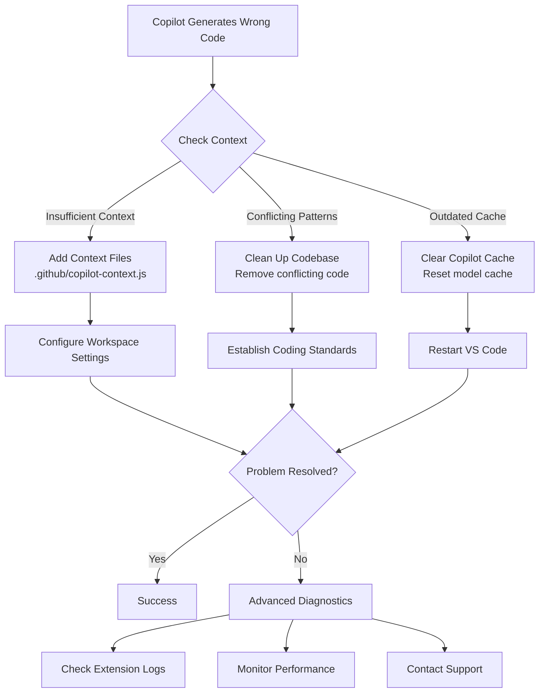
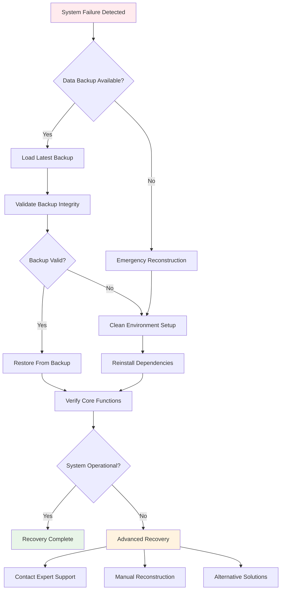

# 🔧 Advanced Troubleshooting Guide

This comprehensive guide addresses complex issues and edge cases in the design-to-code workflow, providing advanced solutions and debugging strategies.

[](#)
[](#)
[](#)

## 📋 Table of Contents
- [AI Tool Troubleshooting](#ai-tool-troubleshooting)
- [Complex Integration Issues](#complex-integration-issues)
- [Performance and Optimization Problems](#performance-and-optimization-problems)
- [Enterprise-Scale Challenges](#enterprise-scale-challenges)
- [Debugging Strategies](#debugging-strategies)
- [Platform-Specific Issues](#platform-specific-issues)
- [Emergency Recovery Procedures](#emergency-recovery-procedures)
- [Preventive Measures](#preventive-measures)

## 🤖 AI Tool Troubleshooting

### 🤖 GitHub Copilot Advanced Issues

#### 🚨 Issue: Copilot Generates Incorrect Patterns



| **Symptoms** | **Root Causes** |
|---|---|
| Generated code doesn't match design system | Insufficient context in workspace |
| Inconsistent naming conventions | Conflicting code patterns in project |
| Wrong framework patterns | Outdated Copilot model cache |

**Advanced Solutions**:

1. **Create Custom Context Files**:
```javascript
// .github/copilot-context.js
/**
 * This file provides context to GitHub Copilot about our design system
 * @copilot-context
 */

// Our component pattern
export const ComponentPattern = {
  structure: 'Atomic Design',
  styling: 'styled-components',
  state: 'React Hooks',
  testing: 'React Testing Library',
  naming: {
    components: 'PascalCase',
    props: 'camelCase',
    files: 'ComponentName.tsx',
  }
};

// Example component structure Copilot should follow
export const ExampleComponent = `
interface ComponentProps {
  variant?: 'primary' | 'secondary';
  size?: 'small' | 'medium' | 'large';
  children: React.ReactNode;
}

export const Component: React.FC<ComponentProps> = ({
  variant = 'primary',
  size = 'medium',
  children
}) => {
  return (
    <StyledComponent variant={variant} size={size}>
      {children}
    </StyledComponent>
  );
};
`;
```

2. **Configure Workspace Settings**:
```json
// .vscode/settings.json
{
  "github.copilot.advanced": {
    "debug.overrideEngine": "gpt-4",
    "inlineSuggest.enableGraphQLContext": true,
    "inlineSuggest.enableSemanticContext": true
  },
  "github.copilot.editor.enableCodeActions": true,
  "files.associations": {
    "*.design": "typescript"
  }
}
```

3. **Reset Copilot Context**:
```bash
# Clear Copilot cache
rm -rf ~/.copilot/cache

# Restart VS Code with fresh context
code --disable-extensions
code --enable-proposed-api GitHub.copilot
```

#### Issue: Copilot Performance Degradation
**Symptoms**:
- Slow suggestions
- Incomplete code generation
- High CPU usage

**Advanced Solutions**:

1. **Optimize Workspace**:
```javascript
// copilot-optimizer.js
const optimizeCopilotWorkspace = async () => {
  // Exclude large files from context
  const excludePatterns = [
    '**/node_modules/**',
    '**/dist/**',
    '**/build/**',
    '**/*.test.{js,jsx,ts,tsx}',
    '**/coverage/**'
  ];
  
  // Create focused workspace
  const copilotWorkspace = {
    folders: ['src/components', 'src/design-system'],
    exclude: excludePatterns,
    contextLimit: 8192 // tokens
  };
  
  return copilotWorkspace;
};
```

2. **Monitor Performance**:
```typescript
// VS Code extension for Copilot metrics
interface CopilotMetrics {
  responseTime: number;
  tokenCount: number;
  cacheHitRate: number;
  errorRate: number;
}

const monitorCopilot = (): CopilotMetrics => {
  return vscode.workspace.getConfiguration('github.copilot')
    .get<CopilotMetrics>('metrics');
};
```

### MCP Server Connection Issues

#### Issue: MCP Server Fails to Connect to Figma
**Symptoms**:
- "Connection refused" errors
- Timeout on Figma API calls
- Authentication failures

**Advanced Diagnostics**:

```bash
# Test MCP Server connectivity
curl -X POST http://localhost:3000/mcp/health \
  -H "Content-Type: application/json" \
  -d '{"service": "figma"}'

# Check Figma API directly
curl -H "X-Figma-Token: $FIGMA_TOKEN" \
  "https://api.figma.com/v1/me"

# Validate MCP configuration
npx mcp-server validate --config .mcp/config.json
```

**Solutions**:

1. **Implement Retry Logic**:
```typescript
// mcp-connection-manager.ts
class MCPConnectionManager {
  private retryCount = 0;
  private maxRetries = 5;
  private backoffMultiplier = 2;

  async connectWithRetry(): Promise<MCPConnection> {
    try {
      return await this.connect();
    } catch (error) {
      if (this.retryCount < this.maxRetries) {
        const delay = Math.pow(this.backoffMultiplier, this.retryCount) * 1000;
        console.log(`Retrying connection in ${delay}ms...`);
        await this.sleep(delay);
        this.retryCount++;
        return this.connectWithRetry();
      }
      throw new Error(`Failed to connect after ${this.maxRetries} attempts: ${error}`);
    }
  }

  private async connect(): Promise<MCPConnection> {
    const config = await this.loadConfig();
    return new MCPConnection(config);
  }

  private sleep(ms: number): Promise<void> {
    return new Promise(resolve => setTimeout(resolve, ms));
  }
}
```

2. **Create Fallback Mechanism**:
```typescript
// figma-fallback-handler.ts
class FigmaFallbackHandler {
  async getDesignData(fileId: string): Promise<DesignData> {
    try {
      // Try MCP Server first
      return await this.mcpServer.getDesignData(fileId);
    } catch (error) {
      console.warn('MCP Server failed, falling back to direct API');
      
      try {
        // Fallback to direct Figma API
        return await this.figmaAPI.getFile(fileId);
      } catch (apiError) {
        console.warn('Direct API failed, using cached data');
        
        // Final fallback to cached data
        return await this.cache.getDesignData(fileId);
      }
    }
  }
}
```

### Azure AI Integration Problems

#### Issue: Azure AI Model Timeout on Large Designs
**Symptoms**:
- Timeout errors on complex Figma files
- Partial analysis results
- Memory exhaustion

**Advanced Solutions**:

1. **Implement Chunking Strategy**:
```typescript
// azure-ai-chunking.ts
class AzureAIChunker {
  private chunkSize = 50; // components per chunk
  
  async analyzelargeDesign(design: FigmaFile): Promise<AnalysisResult> {
    const chunks = this.chunkComponents(design.components, this.chunkSize);
    const results: AnalysisResult[] = [];
    
    // Process chunks in parallel with concurrency limit
    const concurrencyLimit = 3;
    for (let i = 0; i < chunks.length; i += concurrencyLimit) {
      const batch = chunks.slice(i, i + concurrencyLimit);
      const batchResults = await Promise.all(
        batch.map(chunk => this.analyzeChunk(chunk))
      );
      results.push(...batchResults);
    }
    
    return this.mergeResults(results);
  }
  
  private chunkComponents(components: Component[], size: number): Component[][] {
    const chunks: Component[][] = [];
    for (let i = 0; i < components.length; i += size) {
      chunks.push(components.slice(i, i + size));
    }
    return chunks;
  }
  
  private async analyzeChunk(chunk: Component[]): Promise<AnalysisResult> {
    // Implement retry logic for chunk analysis
    return await this.retryWithBackoff(() => 
      this.azureClient.analyzeComponents(chunk)
    );
  }
}
```

2. **Optimize Azure Configuration**:
```json
// azure-ai-config.json
{
  "endpoint": "https://your-instance.cognitiveservices.azure.com/",
  "apiVersion": "2024-05-01-preview",
  "deploymentName": "design-to-code-gpt4",
  "configuration": {
    "maxTokens": 4096,
    "temperature": 0.2,
    "topP": 0.95,
    "frequencyPenalty": 0.5,
    "presencePenalty": 0.5,
    "timeout": 120000,
    "retryPolicy": {
      "maxRetries": 3,
      "retryDelay": 1000,
      "maxRetryDelay": 60000
    }
  }
}
```

## 🔗 Complex Integration Issues

### Multi-Tool Synchronization Problems

#### Issue: Design Token Mismatch Across Tools
**Symptoms**:
- Figma tokens don't match generated code
- Storybook shows different values
- Production app has inconsistencies

**Root Cause Analysis**:
```typescript
// token-validator.ts
class TokenValidator {
  async validateTokenConsistency(): Promise<ValidationReport> {
    const sources = {
      figma: await this.getFigmaTokens(),
      code: await this.getCodeTokens(),
      storybook: await this.getStorybookTokens(),
      production: await this.getProductionTokens()
    };
    
    const inconsistencies = this.findInconsistencies(sources);
    return this.generateReport(inconsistencies);
  }
  
  private findInconsistencies(sources: TokenSources): Inconsistency[] {
    const inconsistencies: Inconsistency[] = [];
    const baseTokens = sources.figma;
    
    for (const [source, tokens] of Object.entries(sources)) {
      if (source === 'figma') continue;
      
      for (const [key, value] of Object.entries(baseTokens)) {
        if (tokens[key] !== value) {
          inconsistencies.push({
            token: key,
            figmaValue: value,
            actualValue: tokens[key],
            source
          });
        }
      }
    }
    
    return inconsistencies;
  }
}
```

**Advanced Solution - Token Sync Pipeline**:
```yaml
# .github/workflows/token-sync.yml
name: Design Token Synchronization

on:
  schedule:
    - cron: '0 */6 * * *' # Every 6 hours
  workflow_dispatch:
    inputs:
      force-update:
        description: 'Force update all tokens'
        required: false
        default: 'false'

jobs:
  sync-tokens:
    runs-on: ubuntu-latest
    steps:
      - uses: actions/checkout@v3
      
      - name: Fetch Latest Figma Tokens
        id: figma-tokens
        run: |
          node scripts/fetch-figma-tokens.js
          echo "::set-output name=hash::$(sha256sum tokens/figma.json)"
      
      - name: Compare Token Versions
        id: compare
        run: |
          if [ "${{ github.event.inputs.force-update }}" = "true" ]; then
            echo "::set-output name=changed::true"
          else
            CURRENT_HASH=$(sha256sum tokens/current.json || echo "none")
            if [ "${{ steps.figma-tokens.outputs.hash }}" != "$CURRENT_HASH" ]; then
              echo "::set-output name=changed::true"
            else
              echo "::set-output name=changed::false"
            fi
          fi
      
      - name: Update Token Files
        if: steps.compare.outputs.changed == 'true'
        run: |
          # Update all token files
          node scripts/update-design-tokens.js
          node scripts/generate-css-variables.js
          node scripts/update-storybook-theme.js
          
      - name: Run Token Validation
        run: node scripts/validate-tokens.js
        
      - name: Create Pull Request
        if: steps.compare.outputs.changed == 'true'
        uses: peter-evans/create-pull-request@v4
        with:
          commit-message: 'chore: sync design tokens from Figma'
          title: 'Design Token Update'
          body: |
            Automated design token synchronization
            
            Changes detected in Figma tokens:
            ${{ steps.figma-tokens.outputs.changes }}
```

### Component Library Version Conflicts

#### Issue: Incompatible Versions Between Projects
**Symptoms**:
- Build errors in consuming applications
- Style conflicts
- Missing component props

**Advanced Dependency Resolution**:

1. **Create Compatibility Matrix**:
```typescript
// compatibility-matrix.ts
interface CompatibilityMatrix {
  [componentLibVersion: string]: {
    minReactVersion: string;
    maxReactVersion: string;
    requiredPeerDeps: Record<string, string>;
    breakingChanges: string[];
  };
}

const compatibilityMatrix: CompatibilityMatrix = {
  '2.0.0': {
    minReactVersion: '17.0.0',
    maxReactVersion: '18.x.x',
    requiredPeerDeps: {
      'styled-components': '^5.3.0',
      '@types/react': '^17.0.0 || ^18.0.0'
    },
    breakingChanges: [
      'Button: removed `color` prop, use `variant` instead',
      'Card: changed `elevation` prop values'
    ]
  }
};

// Automated compatibility checker
export const checkCompatibility = (
  libVersion: string,
  projectDeps: Record<string, string>
): CompatibilityResult => {
  const requirements = compatibilityMatrix[libVersion];
  const issues: string[] = [];
  
  // Check React version
  const reactVersion = projectDeps['react'];
  if (!semver.satisfies(reactVersion, `>=${requirements.minReactVersion}`)) {
    issues.push(`React ${reactVersion} is below minimum ${requirements.minReactVersion}`);
  }
  
  // Check peer dependencies
  for (const [dep, required] of Object.entries(requirements.requiredPeerDeps)) {
    if (!projectDeps[dep] || !semver.satisfies(projectDeps[dep], required)) {
      issues.push(`${dep} version mismatch: required ${required}, found ${projectDeps[dep]}`);
    }
  }
  
  return {
    compatible: issues.length === 0,
    issues,
    breakingChanges: requirements.breakingChanges
  };
};
```

2. **Implement Version Migration Tool**:
```typescript
// migration-tool.ts
class ComponentLibraryMigrator {
  async migrate(fromVersion: string, toVersion: string, projectPath: string) {
    const migrations = await this.loadMigrations(fromVersion, toVersion);
    
    for (const migration of migrations) {
      console.log(`Running migration: ${migration.description}`);
      await this.runMigration(migration, projectPath);
    }
  }
  
  private async runMigration(migration: Migration, projectPath: string) {
    const files = await this.findAffectedFiles(migration.filePattern, projectPath);
    
    for (const file of files) {
      const content = await fs.readFile(file, 'utf-8');
      const updated = await migration.transform(content);
      
      if (content !== updated) {
        await fs.writeFile(file, updated);
        console.log(`Updated: ${file}`);
      }
    }
  }
}

// Example migration
const buttonMigration: Migration = {
  description: 'Update Button color prop to variant',
  filePattern: '**/*.{tsx,jsx}',
  transform: async (content: string) => {
    // Use AST transformation for accurate updates
    const ast = parse(content, { jsx: true });
    
    visit(ast, {
      JSXAttribute(path) {
        if (
          path.node.name.name === 'color' &&
          path.parent.name.name === 'Button'
        ) {
          path.node.name.name = 'variant';
        }
      }
    });
    
    return generate(ast);
  }
};
```

## ⚡ Performance and Optimization Problems

### Memory Leaks in Component Generation

#### Issue: VS Code Memory Exhaustion During Large Conversions
**Symptoms**:
- VS Code becomes unresponsive
- "JavaScript heap out of memory" errors
- System slowdown

**Advanced Memory Management**:

1. **Implement Streaming Processing**:
```typescript
// streaming-processor.ts
import { Transform } from 'stream';

class ComponentGeneratorStream extends Transform {
  private buffer: Component[] = [];
  private bufferSize = 10;
  
  _transform(chunk: any, encoding: string, callback: Function) {
    const component = JSON.parse(chunk);
    this.buffer.push(component);
    
    if (this.buffer.length >= this.bufferSize) {
      this.processBuffer();
    }
    
    callback();
  }
  
  _flush(callback: Function) {
    if (this.buffer.length > 0) {
      this.processBuffer();
    }
    callback();
  }
  
  private async processBuffer() {
    const components = [...this.buffer];
    this.buffer = [];
    
    // Process components with memory-efficient approach
    for (const component of components) {
      const code = await this.generateComponent(component);
      this.push(code);
      
      // Allow garbage collection
      if (global.gc) {
        global.gc();
      }
    }
  }
}
```

2. **Configure VS Code Memory Limits**:
```json
// .vscode/settings.json
{
  "typescript.tsserver.maxTsServerMemory": 4096,
  "extensions.experimental.affinity": {
    "vscodevim.vim": 1,
    "GitHub.copilot": 2
  },
  "files.watcherExclude": {
    "**/node_modules/**": true,
    "**/dist/**": true,
    "**/.git/**": true
  }
}
```

3. **Create Memory Profiling Tools**:
```typescript
// memory-profiler.ts
class MemoryProfiler {
  private snapshots: MemorySnapshot[] = [];
  
  startProfiling(label: string) {
    const initial = process.memoryUsage();
    this.snapshots.push({
      label,
      timestamp: Date.now(),
      memory: initial
    });
  }
  
  endProfiling(label: string): MemoryReport {
    const final = process.memoryUsage();
    const initial = this.snapshots.find(s => s.label === label);
    
    if (!initial) {
      throw new Error(`No profiling started for ${label}`);
    }
    
    return {
      label,
      duration: Date.now() - initial.timestamp,
      memoryDelta: {
        heapUsed: final.heapUsed - initial.memory.heapUsed,
        heapTotal: final.heapTotal - initial.memory.heapTotal,
        external: final.external - initial.memory.external,
        arrayBuffers: final.arrayBuffers - initial.memory.arrayBuffers
      },
      recommendations: this.getRecommendations(final, initial.memory)
    };
  }
  
  private getRecommendations(final: NodeJS.MemoryUsage, initial: NodeJS.MemoryUsage): string[] {
    const recommendations: string[] = [];
    const heapGrowth = final.heapUsed - initial.heapUsed;
    
    if (heapGrowth > 100 * 1024 * 1024) { // 100MB
      recommendations.push('Consider implementing pagination or chunking');
    }
    
    if (final.heapUsed / final.heapTotal > 0.9) {
      recommendations.push('Heap usage is critical, increase memory limit');
    }
    
    return recommendations;
  }
}
```

### Build Performance Optimization

#### Issue: Slow Component Library Builds
**Symptoms**:
- Build times over 5 minutes
- CI/CD timeouts
- Developer productivity impact

**Advanced Build Optimization**:

1. **Implement Incremental Building**:
```typescript
// incremental-builder.ts
import { createHash } from 'crypto';

class IncrementalBuilder {
  private cache = new Map<string, BuildArtifact>();
  
  async buildComponent(component: ComponentConfig): Promise<BuildResult> {
    const hash = this.calculateHash(component);
    const cached = this.cache.get(hash);
    
    if (cached && !this.isDependencyChanged(component, cached)) {
      console.log(`Using cached build for ${component.name}`);
      return cached.result;
    }
    
    const result = await this.performBuild(component);
    this.cache.set(hash, {
      result,
      dependencies: await this.analyzeDependencies(component),
      timestamp: Date.now()
    });
    
    return result;
  }
  
  private calculateHash(component: ComponentConfig): string {
    const content = JSON.stringify(component);
    return createHash('sha256').update(content).digest('hex');
  }
  
  private async analyzeDependencies(component: ComponentConfig): Promise<string[]> {
    // Implement AST analysis to find dependencies
    const ast = await parseComponent(component.source);
    const imports = findImports(ast);
    return imports.map(imp => imp.source);
  }
}
```

2. **Parallel Build Configuration**:
```javascript
// webpack.config.parallel.js
const ParallelWebpackPlugin = require('parallel-webpack-plugin');
const TerserPlugin = require('terser-webpack-plugin');
const { cpus } = require('os');

module.exports = {
  optimization: {
    minimizer: [
      new TerserPlugin({
        parallel: Math.max(1, cpus().length - 1),
        terserOptions: {
          parse: { ecma: 2020 },
          compress: { ecma: 2020 },
          mangle: { safari10: true }
        }
      })
    ],
    splitChunks: {
      chunks: 'all',
      cacheGroups: {
        vendor: {
          test: /[\\/]node_modules[\\/]/,
          name: 'vendors',
          priority: 10
        },
        common: {
          minChunks: 2,
          priority: 5,
          reuseExistingChunk: true
        }
      }
    }
  },
  plugins: [
    new ParallelWebpackPlugin({
      workers: cpus().length,
      workerOptions: {
        env: process.env,
        resourceLimits: {
          maxOldGenerationSizeMb: 2048
        }
      }
    })
  ]
};
```

## 🏢 Enterprise-Scale Challenges

### Multi-Team Design System Conflicts

#### Issue: Conflicting Component Implementations
**Symptoms**:
- Different teams create similar components
- Naming conflicts
- Inconsistent behaviors

**Advanced Governance Solution**:

1. **Component Registry System**:
```typescript
// component-registry.ts
interface ComponentRegistry {
  register(component: ComponentDefinition): Promise<void>;
  checkConflicts(component: ComponentDefinition): ConflictReport;
  approve(componentId: string, approver: User): Promise<void>;
}

class EnterpriseComponentRegistry implements ComponentRegistry {
  private registry = new Map<string, ComponentDefinition>();
  
  async register(component: ComponentDefinition): Promise<void> {
    const conflicts = this.checkConflicts(component);
    
    if (conflicts.hasConflicts) {
      throw new ConflictError(conflicts);
    }
    
    // Semantic analysis
    const similar = await this.findSemanticallySimilar(component);
    if (similar.length > 0) {
      component.metadata.similarComponents = similar;
      await this.notifyReviewers(component, similar);
    }
    
    this.registry.set(component.id, component);
    await this.publishToTeams(component);
  }
  
  private async findSemanticallySimilar(
    component: ComponentDefinition
  ): Promise<ComponentDefinition[]> {
    // Use AI to find semantically similar components
    const embeddings = await this.generateEmbeddings(component);
    const similar: ComponentDefinition[] = [];
    
    for (const [id, existing] of this.registry) {
      const existingEmbeddings = await this.generateEmbeddings(existing);
      const similarity = this.cosineSimilarity(embeddings, existingEmbeddings);
      
      if (similarity > 0.8) {
        similar.push(existing);
      }
    }
    
    return similar;
  }
}
```

2. **Automated Design System Governance**:
```yaml
# .github/workflows/design-system-governance.yml
name: Design System Governance

on:
  pull_request:
    paths:
      - 'packages/components/**'
      - 'packages/tokens/**'

jobs:
  component-review:
    runs-on: ubuntu-latest
    steps:
      - uses: actions/checkout@v3
      
      - name: Component Analysis
        id: analysis
        run: |
          npx design-system-analyzer analyze \
            --check-naming \
            --check-props \
            --check-accessibility \
            --check-duplicates
      
      - name: Visual Regression Check
        run: |
          npx chromatic --project-token=${{ secrets.CHROMATIC_TOKEN }} \
            --only-changed \
            --exit-zero-on-changes
      
      - name: Semantic Analysis
        run: |
          node scripts/semantic-component-analysis.js \
            --threshold=0.85 \
            --report=analysis-report.json
      
      - name: Comment PR
        uses: actions/github-script@v6
        with:
          script: |
            const analysis = require('./analysis-report.json');
            let comment = '## Design System Analysis\n\n';
            
            if (analysis.conflicts.length > 0) {
              comment += '### ⚠️ Conflicts Detected\n';
              analysis.conflicts.forEach(conflict => {
                comment += `- ${conflict.description}\n`;
              });
            }
            
            if (analysis.similar.length > 0) {
              comment += '\n### 📊 Similar Components Found\n';
              analysis.similar.forEach(similar => {
                comment += `- ${similar.name} (${similar.similarity}% match)\n`;
              });
            }
            
            github.rest.issues.createComment({
              issue_number: context.issue.number,
              owner: context.repo.owner,
              repo: context.repo.repo,
              body: comment
            });
```

### Cross-Platform Component Synchronization

#### Issue: Maintaining Consistency Across Web, iOS, and Android
**Symptoms**:
- Design drift between platforms
- Inconsistent behavior
- Maintenance overhead

**Advanced Cross-Platform Solution**:

1. **Unified Component Specification**:
```typescript
// unified-component-spec.ts
interface UnifiedComponentSpec {
  meta: {
    name: string;
    version: string;
    platforms: Platform[];
  };
  design: {
    tokens: DesignTokens;
    variants: Variant[];
    states: State[];
  };
  behavior: {
    interactions: Interaction[];
    animations: Animation[];
    accessibility: A11ySpec;
  };
  implementation: {
    web: WebImplementation;
    ios: IOSImplementation;
    android: AndroidImplementation;
  };
}

class CrossPlatformGenerator {
  async generateFromSpec(spec: UnifiedComponentSpec): Promise<GeneratedCode> {
    const results: GeneratedCode = {};
    
    // Generate for each platform
    if (spec.meta.platforms.includes('web')) {
      results.web = await this.generateWeb(spec);
    }
    
    if (spec.meta.platforms.includes('ios')) {
      results.ios = await this.generateIOS(spec);
    }
    
    if (spec.meta.platforms.includes('android')) {
      results.android = await this.generateAndroid(spec);
    }
    
    // Validate consistency
    await this.validateCrossPlatform(results);
    
    return results;
  }
  
  private async generateWeb(spec: UnifiedComponentSpec): Promise<string> {
    const template = await this.loadTemplate('web');
    return this.applyTemplate(template, spec);
  }
  
  private async generateIOS(spec: UnifiedComponentSpec): Promise<string> {
    const template = await this.loadTemplate('ios');
    const swiftCode = this.applyTemplate(template, spec);
    
    // Platform-specific adjustments
    return this.adaptForIOS(swiftCode, spec);
  }
}
```

## 🐛 Debugging Strategies

### Advanced Debugging Techniques

#### Strategy 1: Time-Travel Debugging for Component States
```typescript
// time-travel-debugger.ts
class ComponentTimeTravel {
  private stateHistory: StateSnapshot[] = [];
  private currentIndex = -1;
  
  recordState(component: Component, state: any, props: any) {
    const snapshot: StateSnapshot = {
      timestamp: Date.now(),
      componentName: component.constructor.name,
      state: JSON.parse(JSON.stringify(state)),
      props: JSON.parse(JSON.stringify(props)),
      stackTrace: this.captureStackTrace()
    };
    
    // Remove future states if we've time-traveled
    if (this.currentIndex < this.stateHistory.length - 1) {
      this.stateHistory = this.stateHistory.slice(0, this.currentIndex + 1);
    }
    
    this.stateHistory.push(snapshot);
    this.currentIndex++;
  }
  
  timeTravel(steps: number): StateSnapshot | null {
    const targetIndex = this.currentIndex + steps;
    
    if (targetIndex < 0 || targetIndex >= this.stateHistory.length) {
      return null;
    }
    
    this.currentIndex = targetIndex;
    return this.stateHistory[this.currentIndex];
  }
  
  getDiff(indexA: number, indexB: number): StateDiff {
    const snapshotA = this.stateHistory[indexA];
    const snapshotB = this.stateHistory[indexB];
    
    return {
      stateDiff: this.deepDiff(snapshotA.state, snapshotB.state),
      propsDiff: this.deepDiff(snapshotA.props, snapshotB.props),
      timeDelta: snapshotB.timestamp - snapshotA.timestamp
    };
  }
}
```

#### Strategy 2: AI-Powered Error Analysis
```typescript
// ai-error-analyzer.ts
class AIErrorAnalyzer {
  async analyzeError(error: Error, context: ErrorContext): Promise<ErrorAnalysis> {
    const prompt = this.buildErrorPrompt(error, context);
    
    const analysis = await this.aiClient.analyze({
      prompt,
      model: 'error-analysis-v2',
      temperature: 0.3
    });
    
    return {
      rootCause: analysis.rootCause,
      suggestedFixes: analysis.fixes,
      relatedIssues: await this.findRelatedIssues(analysis),
      preventionStrategies: analysis.prevention
    };
  }
  
  private buildErrorPrompt(error: Error, context: ErrorContext): string {
    return `
    Error Analysis Request:
    
    Error: ${error.message}
    Stack: ${error.stack}
    
    Component: ${context.componentName}
    Props: ${JSON.stringify(context.props)}
    State: ${JSON.stringify(context.state)}
    
    Recent Actions: ${context.recentActions.join(', ')}
    
    Analyze this error and provide:
    1. Root cause analysis
    2. Suggested fixes with code examples
    3. Prevention strategies
    `;
  }
}
```

## 💻 Platform-Specific Issues

### Windows-Specific Problems

#### Issue: Path Length Limitations
**Symptoms**:
- "File name too long" errors
- Build failures on Windows
- Git checkout issues

**Solutions**:

1. **Enable Long Path Support**:
```powershell
# Run as Administrator
New-ItemProperty -Path "HKLM:\SYSTEM\CurrentControlSet\Control\FileSystem" `
  -Name "LongPathsEnabled" -Value 1 -PropertyType DWORD -Force

# For Git
git config --system core.longpaths true
```

2. **Use Path Shortening**:
```javascript
// webpack.config.js
module.exports = {
  output: {
    path: path.join(__dirname, 'dist'),
    filename: '[name].[contenthash:8].js', // Shorter hash
  },
  optimization: {
    moduleIds: 'deterministic',
    chunkIds: 'deterministic'
  }
};
```

### macOS-Specific Problems

#### Issue: Code Signing and Notarization
**Symptoms**:
- "Application can't be opened" errors
- Security warnings
- Gatekeeper blocks

**Solutions**:

```bash
# Sign your Node.js application
codesign --sign "Developer ID Application: Your Name" \
  --deep --force \
  --options runtime \
  --entitlements entitlements.plist \
  your-app.app

# Notarize
xcrun altool --notarize-app \
  --primary-bundle-id "com.yourcompany.app" \
  --username "apple-id@example.com" \
  --password "@keychain:AC_PASSWORD" \
  --file your-app.zip
```

## 🚨 Emergency Recovery Procedures

### Catastrophic Failure Recovery

#### Scenario: Complete Environment Corruption



**Steps**:

1. **Create Clean Environment**:
```bash
#!/bin/bash
# emergency-reset.sh

# Backup current state
tar -czf backup-$(date +%Y%m%d-%H%M%S).tar.gz \
  --exclude=node_modules \
  --exclude=.git \
  .

# Clean environment
rm -rf node_modules
rm -rf .next .cache dist build
rm package-lock.json yarn.lock

# Reset Git to last known good state
git reset --hard origin/main

# Reinstall with exact versions
npm ci || npm install

# Verify environment
npm run verify-env
```

2. **Restore From Backup**:
```typescript
// restore-manager.ts
class RestoreManager {
  async restoreFromBackup(backupId: string): Promise<void> {
    const backup = await this.loadBackup(backupId);
    
    // Validate backup integrity
    if (!await this.validateBackup(backup)) {
      throw new Error('Backup validation failed');
    }
    
    // Restore in stages
    await this.restoreDesignTokens(backup.tokens);
    await this.restoreComponents(backup.components);
    await this.restoreConfiguration(backup.config);
    
    // Verify restoration
    await this.runHealthChecks();
  }
}
```

### Data Loss Prevention

```typescript
// auto-backup-system.ts
class AutoBackupSystem {
  private interval: NodeJS.Timer;
  
  start() {
    this.interval = setInterval(() => {
      this.performBackup();
    }, 30 * 60 * 1000); // Every 30 minutes
    
    // Backup on significant events
    process.on('SIGTERM', () => this.performBackup());
    process.on('SIGINT', () => this.performBackup());
  }
  
  private async performBackup() {
    const backup = {
      timestamp: Date.now(),
      designSystem: await this.backupDesignSystem(),
      components: await this.backupComponents(),
      configuration: await this.backupConfiguration()
    };
    
    await this.saveBackup(backup);
    await this.pruneOldBackups();
  }
}
```

## 🛡️ Preventive Measures

### Automated Health Monitoring

```typescript
// health-monitor.ts
class DesignSystemHealthMonitor {
  private checks: HealthCheck[] = [
    new TokenConsistencyCheck(),
    new ComponentIntegrityCheck(),
    new PerformanceCheck(),
    new AccessibilityCheck()
  ];
  
  async runHealthChecks(): Promise<HealthReport> {
    const results = await Promise.all(
      this.checks.map(check => check.run())
    );
    
    const report: HealthReport = {
      timestamp: Date.now(),
      overall: this.calculateOverallHealth(results),
      checks: results,
      recommendations: this.generateRecommendations(results)
    };
    
    if (report.overall < 0.8) {
      await this.alertTeam(report);
    }
    
    return report;
  }
}
```

### Continuous Validation Pipeline

```yaml
# .github/workflows/continuous-validation.yml
name: Continuous Design System Validation

on:
  schedule:
    - cron: '0 * * * *' # Every hour
  workflow_dispatch:

jobs:
  validate:
    runs-on: ubuntu-latest
    steps:
      - uses: actions/checkout@v3
      
      - name: Run Health Checks
        run: npm run health-check
        
      - name: Validate Token Consistency
        run: npm run validate-tokens
        
      - name: Check Component Integrity
        run: npm run validate-components
        
      - name: Performance Benchmarks
        run: npm run benchmark
        
      - name: Generate Report
        run: npm run generate-health-report
        
      - name: Upload Artifacts
        uses: actions/upload-artifact@v3
        with:
          name: health-report-${{ github.run_id }}
          path: reports/
```

## 💡 Key Troubleshooting Principles

1. **Always check the basics first** - Often the issue is simpler than it appears
2. **Isolate the problem** - Use binary search to narrow down the cause
3. **Document everything** - Keep detailed logs of issues and solutions
4. **Test incrementally** - Verify each fix before moving to the next
5. **Have rollback plans** - Always be able to return to a working state

## 🔜 Next Steps

For hands-on practice with these troubleshooting techniques, check out the [Workshop Structure Guide](workshop-structure-guide.md) which includes debugging exercises and real-world scenarios.

---

## 🧭 Navigation

| Previous | Up | Next |
|----------|----|----- |
| [🏗️ Workshop Structure](workshop-structure-guide.md) | [📖 Main README](../README.md) | [📋 Quick Start](QUICK_START.md) |

**Need Immediate Help?**: [🚑 Emergency Recovery](#emergency-recovery-procedures) | [📞 Community Support](https://github.com/paulasilvatech/Design-to-Code-Dev/discussions) | [📚 Documentation](../README.md)

**Workshop Modules**: [🚀 Module 1](design-to-code-workshop-part-01.md) | [📊 Module 2](design-to-code-workshop-part-02.md) | [🤖 Module 3](design-to-code-workshop-part-03.md) | [🏗️ All Modules](workshop-structure-guide.md)