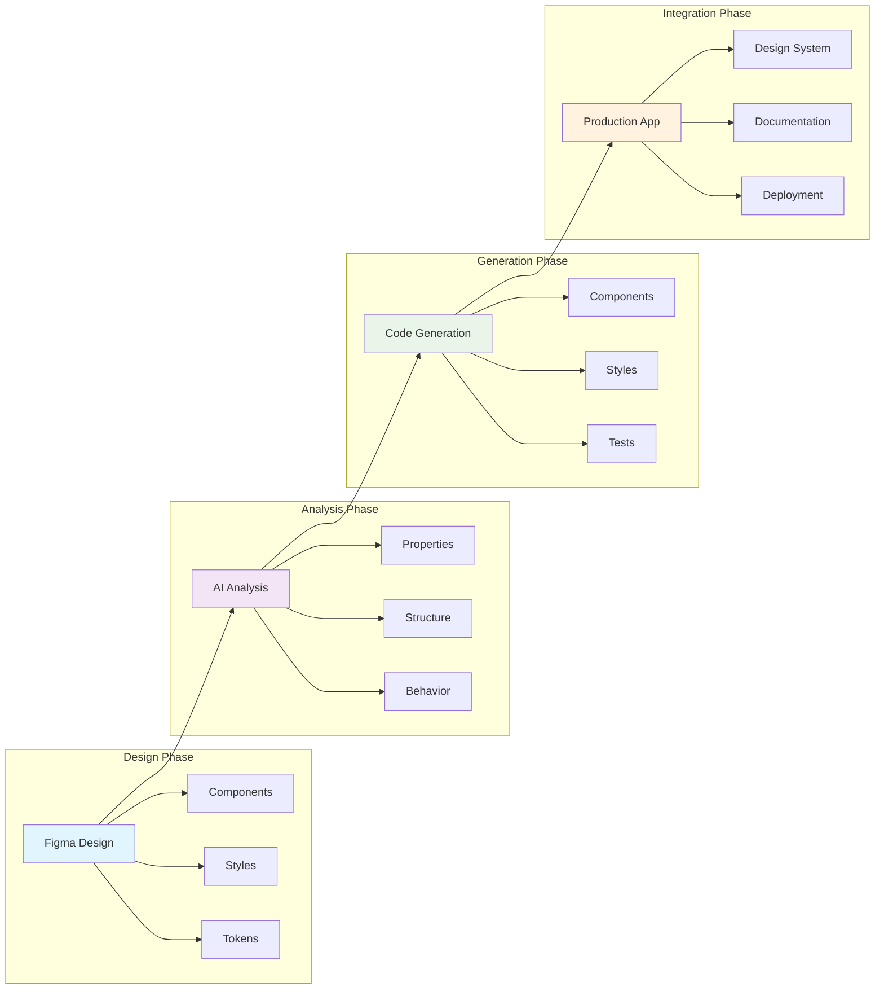

# 🚀 Complete Design-to-Code Workshop Guide - Module 1
## 🎨 From Figma Design to Production Code with AI Assistance

[](#)
[](#)
[](#)

### Table of Contents - Complete Workshop Series

**Module 1** - Setup and Basic Workshop Foundation (This Document)
- [Pre-Workshop Preparation](#pre-workshop-preparation)
- [Step 1: Create Required Accounts](#step-1-create-required-accounts)
- [Step 2: Install Required Tools](#step-2-install-required-tools)
- [Basic Workshop Introduction](#basic-workshop-90-minutes)
- [Module 1: Understanding Design-to-Code Workflow](#module-1-understanding-design-to-code-workflow-20-minutes)
- [Module 2: Setting Up Your First Figma Design](#module-2-setting-up-your-first-figma-design-20-minutes)

**[Module 2](design-to-code-workshop-part-02.md#-basic-workshop-modules-3-5-github-copilot-and-component-generation)** - Basic Workshop Modules 3-5
- Module 3: GitHub Copilot for Component Generation
- Module 4: Converting Your First Design
- Module 5: Final Exercise - Complete Landing Page

**[Module 3](design-to-code-workshop-part-03.md#-intermediate-workshop-advanced-figma-and-component-libraries-2-hours)** - Intermediate Workshop (2 hours)
- Module 1: Advanced Figma Features and Auto Layout
- Module 2: Component Library Creation
- Module 3: Design Systems Integration
- Module 4: Responsive Design Implementation

**[Module 4](design-to-code-workshop-part-04.md#-advanced-workshop-part-1-mcp-server-and-github-agent-automation-3-hours)** - Advanced Workshop Part 1 (3 hours)
- Module 1: Figma MCP Server Integration
- Module 2: GitHub Agent Mode for Design Automation

**[Module 5](design-to-code-workshop-part-05.md#-advanced-workshop-part-2-azure-ai-foundry-setup-and-configuration)** - Azure AI Foundry Setup (3 hours)
- Module 1: Azure AI Services Configuration
- Module 2: Environment Setup and Testing
- Module 3: Credential Management

**[Module 6](design-to-code-workshop-part-06.md#-azure-ai-design-analysis-implementation)** - Azure AI Design Analysis (3 hours)
- Module 1: Multi-Modal AI Implementation
- Module 2: Component Detection System
- Module 3: Code Generation Pipeline

**[Module 7](design-to-code-workshop-part-07.md#-enterprise-design-system-orchestration)** - Enterprise Design System Orchestration (3 hours)
- Module 1: Enterprise-Scale Architecture
- Module 2: Design System Governance
- Module 3: Automated Quality Assurance

**[Module 8](design-to-code-workshop-part-08.md#-complete-integration-and-challenge-lab)** - Complete Integration and Challenge Lab (3 hours)
- Module 1: End-to-End Integration
- Module 2: Challenge Lab Exercise
- Module 3: Production Deployment

---

## 🛠️ Pre-Workshop Preparation

### 🎯 What You'll Learn
By completing these workshops, you will:
- **Master the design-to-code workflow** from Figma to production-ready components
- **Use AI-powered tools** like GitHub Copilot and Azure AI Foundry effectively
- **Implement automated design systems** using MCP Server and GitHub Agents
- **Build responsive, accessible components** following best practices
- **Create scalable component libraries** for enterprise applications
- **Establish CI/CD pipelines** for design system maintenance

### Workshop Overview: The Modern Design-to-Code Pipeline

#### Traditional vs. Modern Approaches
**Traditional Design Handoff**: Manual interpretation, inconsistent implementation, time-consuming
**AI-Enhanced Workflow**: Automated conversion, consistent components, rapid iteration
**Agentic Design Systems**: Self-maintaining, intelligent updates, predictive optimization

#### Key Technologies We'll Master
1. **Figma**: Professional design tool with developer-friendly features
2. **GitHub Copilot**: AI pair programmer for component generation
3. **MCP Server**: Model Context Protocol for Figma automation
4. **GitHub Agent Mode**: Autonomous design-to-code conversion
5. **Azure AI Foundry**: Advanced AI for design analysis and optimization

### Time Investment
- **Preparation**: 45-60 minutes
- **Basic Workshop**: 90 minutes
- **Intermediate Workshop**: 2 hours (recommended)
- **Advanced Workshop**: 6 hours (for senior practitioners)

---

## 🔑 Step 1: Create Required Accounts

### 1.1 Figma Account Setup
**Time Required**: 10 minutes

1. **Create Figma Account**:
   - **Navigate to**: `figma.com`
   - **Click "Sign up"** (top right)
   - **Choose sign-up method**:
     - Google account (recommended for easy access)
     - Email and password
   - **Select account type**: "Professional" (free tier available)
   - **Verify email** if using email signup

2. **Configure Developer Settings**:
   - **Go to Settings** (click profile icon → Settings)
   - **Navigate to "Account"** tab
   - **Enable "Developer mode"** toggle
   - **Generate Personal Access Token**:
     - Click "Personal access tokens"
     - Click "Create new token"
     - Name it: "Design-to-Code Workshop"
     - Copy and save the token securely

3. **Join Workshop Resources**:
   - **Access workshop file**: `figma.com/community/file/workshop-design-system`
   - **Click "Duplicate"** to copy to your drafts
   - **Rename**: "My Design-to-Code Workshop"

**✅ Checkpoint**: You should have access to Figma with developer mode enabled and the workshop file duplicated

### 1.2 GitHub Account and Copilot Setup
**Time Required**: 10 minutes

1. **Create/Verify GitHub Account**:
   - **Go to**: `github.com`
   - **Sign up** or sign in
   - **Complete profile** with professional information
   - **Enable 2FA** (Settings → Security → Two-factor authentication)

2. **Activate GitHub Copilot**:
   - **Navigate to**: `github.com/features/copilot`
   - **Click "Start my free trial"**
   - **Select plan**: Individual ($10/month after 30-day trial)
   - **Complete payment information** (won't be charged during trial)
   - **Verify activation**: Check github.com/settings/copilot

3. **Configure Copilot Settings**:
   - **Go to**: `github.com/settings/copilot`
   - **Enable suggestions** for:
     - ✓ JavaScript/TypeScript
     - ✓ React
     - ✓ CSS/SCSS
     - ✓ HTML
   - **Set suggestion behavior**: "Show suggestions automatically"

**✅ Checkpoint**: GitHub Copilot should show as "Active" in your settings

### 1.3 Azure Account Setup (For Advanced Workshop)
**Time Required**: 15 minutes

1. **Create Azure Free Account**:
   - **Navigate to**: `azure.microsoft.com/free`
   - **Click "Start free"**
   - **Sign in** with Microsoft account or create new
   - **Provide required information**:
     - Phone verification
     - Credit card (identity verification only)
   - **Select free tier options**:
     - $200 credit for 30 days
     - 12 months of free services

2. **Enable AI Services**:
   - **Go to Azure Portal**: `portal.azure.com`
   - **Create Resource Group**:
     - Name: "design-to-code-workshop"
     - Region: Select nearest
   - **Note**: We'll configure AI Foundry in the advanced modules

**✅ Checkpoint**: Azure Portal access confirmed with free credits available

---

## 🛠️ Step 2: Install Required Tools

### 2.1 Install Visual Studio Code
**Time Required**: 10 minutes

**For Windows:**
```powershell
# Option 1: Direct download
# Go to: https://code.visualstudio.com/download
# Download the Windows installer
# Run VSCodeUserSetup-x64-1.xx.x.exe

# Option 2: Using winget (Windows Package Manager)
winget install Microsoft.VisualStudioCode

# Option 3: Using Chocolatey
choco install vscode
```

**For macOS:**
```bash
# Option 1: Direct download
# Go to: https://code.visualstudio.com/download
# Download the Mac installer
# Open the .dmg file and drag to Applications

# Option 2: Using Homebrew
brew install --cask visual-studio-code
```

**For Linux (Ubuntu/Debian):**
```bash
# Add Microsoft GPG key
wget -qO- https://packages.microsoft.com/keys/microsoft.asc | gpg --dearmor > packages.microsoft.gpg
sudo install -o root -g root -m 644 packages.microsoft.gpg /etc/apt/trusted.gpg.d/

# Add VS Code repository
sudo sh -c 'echo "deb [arch=amd64,arm64,armhf signed-by=/etc/apt/trusted.gpg.d/packages.microsoft.gpg] https://packages.microsoft.com/repos/code stable main" > /etc/apt/sources.list.d/vscode.list'

# Update and install
sudo apt update
sudo apt install code
```

**Verify Installation:**
```bash
code --version
# Should display version information
```

### 2.2 Install Essential VS Code Extensions
**Time Required**: 15 minutes

1. **Install GitHub Copilot Extensions**:
```bash
# Install via command line
code --install-extension GitHub.copilot
code --install-extension GitHub.copilot-chat

# Or install from VS Code:
# 1. Open VS Code
# 2. Press Ctrl+Shift+X (Cmd+Shift+X on Mac)
# 3. Search for "GitHub Copilot"
# 4. Install both extensions
```

2. **Install Figma Integration Extensions**:
```bash
# Figma for VS Code
code --install-extension figma.figma-vscode-extension

# Figma to Code
code --install-extension BuilderIO.figma-to-code
```

3. **Install Web Development Extensions**:
```bash
# React/TypeScript development
code --install-extension dsznajder.es7-react-js-snippets
code --install-extension dbaeumer.vscode-eslint
code --install-extension esbenp.prettier-vscode

# CSS/Styling
code --install-extension styled-components.vscode-styled-components
code --install-extension bradlc.vscode-tailwindcss

# Productivity
code --install-extension christian-kohler.path-intellisense
code --install-extension formulahendry.auto-rename-tag
```

4. **Configure GitHub Copilot in VS Code**:
   - **Open VS Code**
   - **Click GitHub Copilot icon** in status bar
   - **Sign in to GitHub** when prompted
   - **Authorize VS Code**
   - **Verify**: Copilot icon should show "Ready"

**✅ Checkpoint**: All extensions installed and GitHub Copilot authenticated

### 2.3 Install Node.js and Package Managers
**Time Required**: 10 minutes

**Recommended: Install Node.js via Node Version Manager (nvm)**

**For Windows (using nvm-windows):**
```powershell
# Download nvm-windows from:
# https://github.com/coreybutler/nvm-windows/releases

# After installation, open new terminal:
nvm install 18.17.0
nvm use 18.17.0
node --version  # Should show v18.17.0
npm --version   # Should show 9.x.x
```

**For macOS/Linux:**
```bash
# Install nvm
curl -o- https://raw.githubusercontent.com/nvm-sh/nvm/v0.39.0/install.sh | bash

# Reload terminal configuration
source ~/.bashrc  # or ~/.zshrc for Zsh

# Install Node.js
nvm install 18.17.0
nvm use 18.17.0
nvm alias default 18.17.0

# Verify installation
node --version  # Should show v18.17.0
npm --version   # Should show 9.x.x
```

**Install Yarn (Optional but Recommended):**
```bash
npm install -g yarn
yarn --version  # Should show 1.22.x
```

### 2.4 Install Git and Configure
**Time Required**: 10 minutes

**For Windows:**
```powershell
# Option 1: Download from https://git-scm.com/download/win

# Option 2: Using winget
winget install Git.Git

# Option 3: Using Chocolatey
choco install git
```

**For macOS:**
```bash
# Git comes with Xcode Command Line Tools
xcode-select --install

# Or using Homebrew
brew install git
```

**For Linux:**
```bash
# Ubuntu/Debian
sudo apt update
sudo apt install git

# Fedora
sudo dnf install git

# Arch
sudo pacman -S git
```

**Configure Git:**
```bash
# Set your identity
git config --global user.name "Your Name"
git config --global user.email "your.email@example.com"

# Set default branch name
git config --global init.defaultBranch main

# Configure line endings
# Windows:
git config --global core.autocrlf true
# macOS/Linux:
git config --global core.autocrlf input

# Enable colored output
git config --global color.ui auto

# Set VS Code as default editor
git config --global core.editor "code --wait"

# Verify configuration
git config --list
```

**✅ Checkpoint**: `git --version` should work and configuration should be complete

### 2.5 Create Workshop Project Structure
**Time Required**: 5 minutes

```bash
# Create workshop directory
mkdir design-to-code-workshop
cd design-to-code-workshop

# Initialize Git repository
git init

# Create project structure
mkdir -p src/components src/styles src/assets docs

# Create initial files
echo "# Design-to-Code Workshop" > README.md
echo "node_modules/" > .gitignore
echo "dist/" >> .gitignore
echo ".env" >> .gitignore

# Create package.json
npm init -y

# Install initial dependencies
npm install react react-dom
npm install -D @types/react @types/react-dom typescript
npm install -D @vitejs/plugin-react vite

# Create basic Vite config
cat > vite.config.ts << EOF
import { defineConfig } from 'vite'
import react from '@vitejs/plugin-react'

export default defineConfig({
  plugins: [react()],
})
EOF

# Create TypeScript config
cat > tsconfig.json << EOF
{
  "compilerOptions": {
    "target": "ES2020",
    "useDefineForClassFields": true,
    "lib": ["ES2020", "DOM", "DOM.Iterable"],
    "module": "ESNext",
    "skipLibCheck": true,
    "moduleResolution": "bundler",
    "allowImportingTsExtensions": true,
    "resolveJsonModule": true,
    "isolatedModules": true,
    "noEmit": true,
    "jsx": "react-jsx",
    "strict": true,
    "noUnusedLocals": true,
    "noUnusedParameters": true,
    "noFallthroughCasesInSwitch": true
  },
  "include": ["src"],
  "references": [{ "path": "./tsconfig.node.json" }]
}
EOF
```

### 2.6 Using Workshop Resources
**Time Required**: 5 minutes

The workshop includes comprehensive resources to accelerate your learning:

#### Available Resources:

1. **Environment Configuration**:
   ```bash
   # Copy the environment template
   cp ../resources/env.template .env
   
   # Edit with your credentials
   nano .env
   ```

2. **Figma Templates**:
   - Pre-built component templates in `resources/figma-templates/`
   - Button, Input, Card, Navigation, Modal, Table, Form, and Tabs
   - Each template includes variants, states, and design tokens

3. **MCP Configuration**:
   ```bash
   # Use the pre-configured MCP setup
   cp ../resources/mcp-config/mcp.config.json .
   ```

4. **Automation Scripts**:
   - Component generation: `resources/scripts/generate-component.js`
   - Design token sync: See workflow templates

5. **Docker Setup** (for advanced users):
   - Production-ready containers in `resources/docker/`
   - Includes MCP Server, Redis, Storybook, and Nginx

6. **GitHub Workflows**:
   - Automated design-to-code pipeline: `resources/workflows/design-to-code.yml`
   - Design synchronization: `resources/workflows/design-sync-pipeline.yml`

**✅ Checkpoint**: Project structure created with all necessary configuration files and access to workshop resources

---

## 🚀 Basic Workshop (90 minutes)

### Introduction: The Design-to-Code Revolution (10 minutes)

#### Understanding Modern Design-to-Code Workflows

**Traditional Handoff Problems**:
1. **Interpretation Errors**: Developers guess designer intent
2. **Inconsistent Implementation**: Same design, different code
3. **Time-Consuming**: Manual pixel-pushing and adjustments
4. **Maintenance Nightmare**: Design updates require code rewrites

**AI-Powered Solutions**:
1. **Automated Extraction**: AI reads design properties directly
2. **Consistent Generation**: Same patterns every time
3. **Rapid Development**: Components in minutes, not hours
4. **Smart Updates**: AI understands design changes

#### The Three Pillars of Design-to-Code

1. **Design Preparation** (Figma):
   - Structured components with Auto Layout
   - Consistent naming conventions
   - Design tokens and variables
   - Proper component organization

2. **AI Assistance** (GitHub Copilot):
   - Context-aware code generation
   - Pattern recognition from designs
   - Best practices enforcement
   - Responsive implementation

3. **Code Quality** (Modern Frameworks):
   - Type-safe implementations
   - Accessible by default
   - Performance optimized
   - Maintainable architecture

#### What Makes This Workshop Different

**Focus on Practical Implementation**:
- Real-world design files
- Production-ready code output
- Enterprise-scale patterns
- Immediate applicability

**AI-First Approach**:
- Leverage latest AI capabilities
- Understand AI limitations
- Human-AI collaboration
- Quality assurance strategies

---

## 📋 Module 1: Understanding Design-to-Code Workflow (20 minutes)

### 1.1 The Design-to-Code Pipeline
**Time Required**: 10 minutes

#### Pipeline Overview



#### Key Stages Explained

1. **Design Stage**:
   - Create components in Figma
   - Define design tokens
   - Establish component variants
   - Document behavior

2. **Analysis Stage**:
   - Extract design properties
   - Identify patterns
   - Map to code structures
   - Validate accessibility

3. **Generation Stage**:
   - AI generates component code
   - Apply framework patterns
   - Implement responsive behavior
   - Add interactivity

4. **Integration Stage**:
   - Integrate with existing codebase
   - Connect to design system
   - Set up documentation
   - Configure CI/CD

### 1.2 Setting Up Your Design-to-Code Environment
**Time Required**: 10 minutes

1. **Open VS Code with Project**:
```bash
# Navigate to project
cd design-to-code-workshop

# Open in VS Code
code .
```

2. **Configure VS Code for Design Work**:
   - **Open Settings**: `Ctrl+,` (Windows/Linux) or `Cmd+,` (Mac)
   - **Search for "Copilot"**
   - **Enable these settings**:
     - ✓ `Github.copilot.enable`
     - ✓ `Github.copilot.inlineSuggest.enable`
     - ✓ `Github.copilot.editor.enableAutoCompletions`

3. **Create Design System Structure**:
```bash
# Create design system directories
mkdir -p src/design-system/{tokens,components,utils}

# Create token files
touch src/design-system/tokens/colors.ts
touch src/design-system/tokens/typography.ts
touch src/design-system/tokens/spacing.ts
touch src/design-system/tokens/index.ts
```

4. **Initialize Design Tokens**:

Create `src/design-system/tokens/colors.ts`:
```typescript
// Design tokens extracted from Figma
export const colors = {
  primary: {
    50: '#E3F2FD',
    100: '#BBDEFB',
    200: '#90CAF9',
    300: '#64B5F6',
    400: '#42A5F5',
    500: '#2196F3', // Primary brand color
    600: '#1E88E5',
    700: '#1976D2',
    800: '#1565C0',
    900: '#0D47A1',
  },
  neutral: {
    0: '#FFFFFF',
    50: '#FAFAFA',
    100: '#F5F5F5',
    200: '#EEEEEE',
    300: '#E0E0E0',
    400: '#BDBDBD',
    500: '#9E9E9E',
    600: '#757575',
    700: '#616161',
    800: '#424242',
    900: '#212121',
  },
  semantic: {
    success: '#4CAF50',
    warning: '#FF9800',
    error: '#F44336',
    info: '#2196F3',
  },
} as const;
```

Create `src/design-system/tokens/typography.ts`:
```typescript
// Typography system from Figma
export const typography = {
  fontFamily: {
    sans: '"Inter", -apple-system, BlinkMacSystemFont, "Segoe UI", Roboto, sans-serif',
    mono: '"Fira Code", "Consolas", "Monaco", monospace',
  },
  fontSize: {
    xs: '0.75rem',    // 12px
    sm: '0.875rem',   // 14px
    base: '1rem',     // 16px
    lg: '1.125rem',   // 18px
    xl: '1.25rem',    // 20px
    '2xl': '1.5rem',  // 24px
    '3xl': '1.875rem', // 30px
    '4xl': '2.25rem', // 36px
    '5xl': '3rem',    // 48px
  },
  fontWeight: {
    regular: 400,
    medium: 500,
    semibold: 600,
    bold: 700,
  },
  lineHeight: {
    tight: 1.25,
    normal: 1.5,
    relaxed: 1.75,
  },
} as const;
```

**✅ Checkpoint**: Design system structure created with initial tokens

---

## 🎨 Module 2: Setting Up Your First Figma Design (20 minutes)

### 2.1 Understanding Figma for Developers
**Time Required**: 10 minutes

1. **Open Figma in Browser**:
   - Go to `figma.com`
   - Sign in with your account
   - Open your duplicated workshop file

2. **Figma Developer Mode**:
   - **Toggle Developer Mode**: Click the `</>` icon in top right
   - **Inspect Panel**: Shows CSS properties
   - **Code Panel**: Shows component code
   - **Assets Panel**: Export settings

3. **Key Figma Concepts for Developers**:

   **Auto Layout** = CSS Flexbox:
   - Direction → `flex-direction`
   - Gap → `gap`
   - Padding → `padding`
   - Alignment → `justify-content`, `align-items`

   **Constraints** = CSS Positioning:
   - Fixed width/height → explicit dimensions
   - Fill container → `width: 100%`
   - Hug contents → `width: fit-content`

   **Components** = React Components:
   - Main Component → Component definition
   - Instance → Component usage
   - Variants → Component props

### 2.2 Creating Your First Component in Figma
**Time Required**: 10 minutes

1. **Create a Button Component**:
   - **Create Frame**: Press `F` and draw a rectangle
   - **Set Properties**:
     - Width: `120px`
     - Height: `48px`
     - Corner Radius: `8px`
     - Fill: Primary-500 (`#2196F3`)

2. **Add Text**:
   - **Press `T`** and click inside frame
   - **Type**: "Button"
   - **Set Text Properties**:
     - Font: Inter
     - Size: 16px
     - Weight: Medium (500)
     - Color: White
     - Alignment: Center

3. **Apply Auto Layout**:
   - **Select the frame**
   - **Press `Shift + A`** or right-click → "Add Auto Layout"
   - **Set Auto Layout Properties**:
     - Direction: Horizontal
     - Horizontal Padding: 24px
     - Vertical Padding: 12px
     - Gap: 8px
     - Alignment: Center

4. **Create Component**:
   - **Select the frame**
   - **Press `Ctrl+Alt+K`** (Windows) or `Cmd+Opt+K`** (Mac)
   - **Or**: Right-click → "Create Component"
   - **Rename**: "Button/Primary/Medium"

5. **Create Variants**:
   - **Select component**
   - **In right panel**: Click "+" next to "Variants"
   - **Add Property**: "Size" with values "Small", "Medium", "Large"
   - **Add Property**: "State" with values "Default", "Hover", "Disabled"
   - **Configure each variant**:

   **Small Size**:
   - Padding: 8px 16px
   - Font Size: 14px
   - Height: 36px

   **Large Size**:
   - Padding: 16px 32px
   - Font Size: 18px
   - Height: 56px

   **Hover State**:
   - Fill: Primary-600 (`#1E88E5`)
   - Add shadow: 0 2px 4px rgba(0,0,0,0.1)

   **Disabled State**:
   - Fill: Neutral-300 (`#E0E0E0`)
   - Text: Neutral-500 (`#9E9E9E`)

**✅ Checkpoint**: You should have a button component with multiple variants in Figma

### 2.3 Exporting Design Properties
**Time Required**: 5 minutes

1. **Switch to Dev Mode**:
   - Click the `</>` icon
   - Select your button component

2. **Review Generated Code**:
   - **CSS Tab**: Shows styling properties
   - **iOS/Android**: Platform-specific code
   - Note the values for our code generation

3. **Copy Design Tokens**:
   ```css
   /* From Figma Dev Mode */
   .button-primary-medium {
     /* Layout */
     display: flex;
     padding: 12px 24px;
     justify-content: center;
     align-items: center;
     gap: 8px;
     
     /* Style */
     border-radius: 8px;
     background: #2196F3;
     
     /* Typography */
     color: #FFF;
     font-family: Inter;
     font-size: 16px;
     font-weight: 500;
     line-height: 24px;
   }
   ```

4. **Export Assets** (if needed):
   - Select any icons or images
   - In right panel, click "Export"
   - Choose format (SVG for icons, PNG for images)
   - Click "Export [Asset Name]"

**✅ Checkpoint**: You understand Figma's Dev Mode and can extract design properties

---

## 🚀 Continue to Module 2

This document has covered:
- ✅ Complete workshop preparation and setup
- ✅ All required tool installations
- ✅ Introduction to design-to-code concepts
- ✅ Basic Figma component creation
- ✅ Design token extraction

**Module 2** will continue with:
- Module 3: GitHub Copilot for Component Generation
- Module 4: Converting Your First Design
- Module 5: Final Exercise - Complete Landing Page
- Troubleshooting Guide

The workshop continues with hands-on coding exercises where you'll use GitHub Copilot to generate React components from your Figma designs.

---

## 🧭 Navigation

| Previous | Up | Next |
|----------|----|----- |
| [📚 Introduction](intro-design-to-code.md) | [📖 Main README](../README.md) | [📊 Module 2: Figma Analysis](design-to-code-workshop-part-02.md) |

**Workshop Progress**: Module 1 of 8 • **Estimated Time**: 90 minutes

**Quick Links**: [📋 Quick Start](QUICK_START.md) | [🏗️ Workshop Structure](workshop-structure-guide.md) | [🛠️ Troubleshooting](advanced-troubleshooting-guide.md)