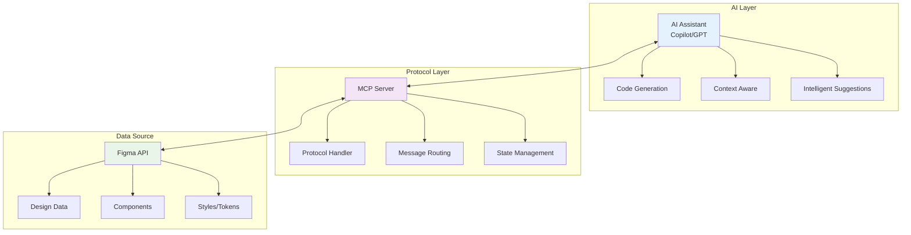
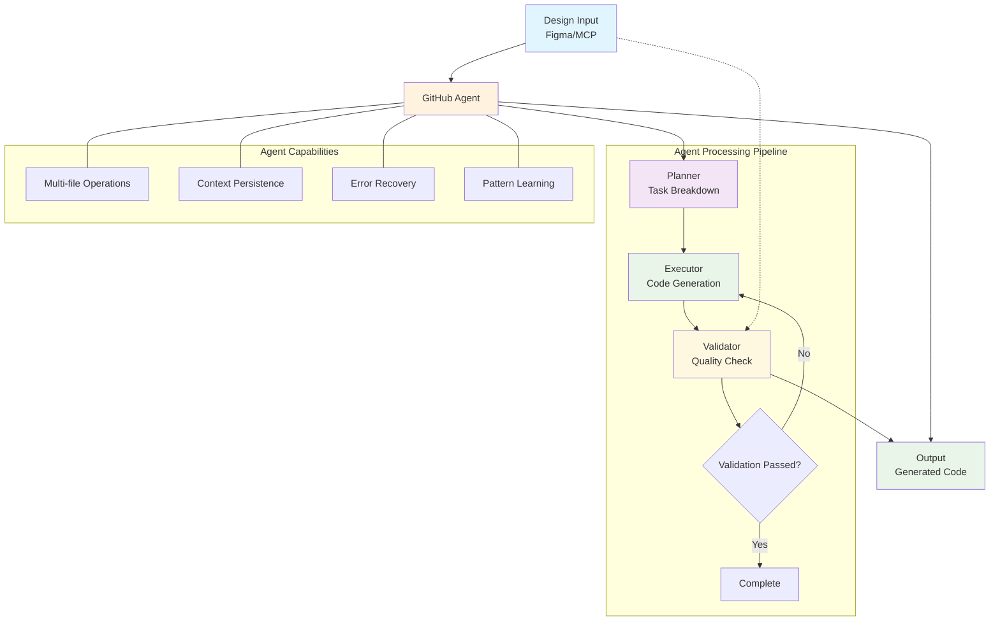

# 🔗 Complete Design-to-Code Workshop Guide - Module 4
## 🤖 Advanced Workshop Module 1: MCP Server and GitHub Agent Automation (3 hours)

### Quick Navigation
- **Module 1**: Setup and Basic Workshop Foundation ✅
- **Module 2**: Basic Workshop Modules 3-5 ✅
- **Module 3**: Intermediate Workshop ✅
- **Module 4**: Advanced Workshop Module 1 (This Document) 📍
- **Module 5**: Advanced Workshop Module 2 (3 hours)

---

## 📋 Advanced Workshop Overview

### What You'll Learn
- **MCP Server Integration**: Connect Figma directly to your development workflow
- **GitHub Agent Mode**: Autonomous code generation and updates
- **Automated Workflows**: End-to-end design-to-code automation
- **AI-Powered Analysis**: Intelligent design interpretation and code generation
- **Enterprise Integration**: Scalable solutions for large teams

### Prerequisites
- Completed Parts 1-3 of this workshop
- Advanced knowledge of React and TypeScript
- Understanding of CI/CD concepts
- GitHub account with admin access to a repository
- Figma account with API access

### Required Additional Setup
- Docker installed and running
- Node.js 18+ with npm/yarn
- Git configured with SSH keys
- VS Code with all previous extensions

---

## 🎨 Module 1: Figma MCP Server Integration (45 minutes)

### 1.1 Understanding MCP (Model Context Protocol)
**Time Required**: 15 minutes

#### What is MCP?

MCP (Model Context Protocol) is a protocol that enables AI assistants to interact with external systems through a standardized interface. The Figma MCP Server specifically allows AI models to:

1. **Read Figma designs programmatically**
2. **Extract component information and properties**
3. **Understand design relationships and hierarchies**
4. **Generate code based on visual analysis**

#### MCP Architecture



### 1.2 Setting Up Figma MCP Server
**Time Required**: 15 minutes

1. **Clone the MCP Server Repository**:
```bash
# Create a directory for MCP tools
mkdir -p ~/mcp-tools
cd ~/mcp-tools

# Clone the Figma MCP server
git clone https://github.com/modelcontextprotocol/figma-mcp-server.git
cd figma-mcp-server
```

2. **Install Dependencies**:
```bash
# Install server dependencies
npm install

# Install global MCP CLI
npm install -g @modelcontextprotocol/cli
```

3. **Configure Environment Variables**:

Create `.env` file:
```bash
# Figma Configuration
FIGMA_API_TOKEN=your_figma_personal_access_token
FIGMA_FILE_KEY=your_figma_file_key
FIGMA_TEAM_ID=your_figma_team_id

# MCP Server Configuration
MCP_SERVER_PORT=3000
MCP_SERVER_HOST=localhost

# AI Integration
OPENAI_API_KEY=your_openai_api_key  # Optional, for enhanced analysis
GITHUB_TOKEN=your_github_token

# Security
MCP_AUTH_TOKEN=generate_secure_token_here
```

4. **Build and Start the Server**:
```bash
# Build the server
npm run build

# Start in development mode
npm run dev

# Or start in production mode
npm run start
```

5. **Verify Server is Running**:
```bash
# Test the health endpoint
curl http://localhost:3000/health

# Expected response:
# {"status":"ok","version":"1.0.0","figma":"connected"}
```

### 1.3 Integrating MCP with VS Code
**Time Required**: 15 minutes

1. **Install MCP VS Code Extension**:
```bash
# Install via command line
code --install-extension modelcontextprotocol.mcp-vscode
```

2. **Configure VS Code Settings**:

Add to `.vscode/settings.json`:
```json
{
  "mcp.servers": {
    "figma": {
      "command": "node",
      "args": ["~/mcp-tools/figma-mcp-server/dist/index.js"],
      "env": {
        "FIGMA_API_TOKEN": "${env:FIGMA_API_TOKEN}",
        "FIGMA_FILE_KEY": "${env:FIGMA_FILE_KEY}"
      }
    }
  },
  "mcp.defaultServer": "figma",
  "mcp.autoConnect": true
}
```

3. **Create MCP Configuration File**:

Create `mcp.config.json` in project root:
```json
{
  "version": "1.0",
  "servers": {
    "figma": {
      "protocol": "http",
      "host": "localhost",
      "port": 3000,
      "auth": {
        "type": "bearer",
        "token": "${MCP_AUTH_TOKEN}"
      },
      "capabilities": [
        "read_designs",
        "extract_components",
        "analyze_layouts",
        "generate_code"
      ]
    }
  },
  "prompts": {
    "component_generation": {
      "template": "Generate a React component from Figma component {{componentId}} with TypeScript and styled-components",
      "context": ["design_tokens", "component_props", "responsive_behavior"]
    },
    "design_analysis": {
      "template": "Analyze the design structure and suggest optimal component architecture",
      "context": ["component_hierarchy", "reusability_patterns", "design_system_alignment"]
    }
  }
}
```

4. **Test MCP Integration**:

Create `test-mcp.js`:
```javascript
const { MCPClient } = require('@modelcontextprotocol/client');

async function testMCPConnection() {
  const client = new MCPClient({
    serverUrl: 'http://localhost:3000',
    authToken: process.env.MCP_AUTH_TOKEN
  });
  
  try {
    // Connect to server
    await client.connect();
    console.log('✅ Connected to MCP Server');
    
    // Test Figma connection
    const figmaStatus = await client.request('figma.checkConnection');
    console.log('✅ Figma Status:', figmaStatus);
    
    // Get file structure
    const fileStructure = await client.request('figma.getFileStructure', {
      fileKey: process.env.FIGMA_FILE_KEY
    });
    console.log('📁 File Structure:', JSON.stringify(fileStructure, null, 2));
    
    // Extract a component
    const component = await client.request('figma.getComponent', {
      fileKey: process.env.FIGMA_FILE_KEY,
      nodeId: '123:456' // Replace with actual node ID
    });
    console.log('🧩 Component:', component);
    
  } catch (error) {
    console.error('❌ Error:', error);
  } finally {
    await client.disconnect();
  }
}

testMCPConnection();
```

**✅ Checkpoint**: MCP Server is running and connected to both Figma and VS Code

---

## 🤖 Module 2: GitHub Agent Mode for Design Automation (45 minutes)

### 2.1 Understanding GitHub Agent Mode
**Time Required**: 15 minutes

#### What is GitHub Agent Mode?

GitHub Agent Mode enables GitHub Copilot to work autonomously on complex tasks:

1. **Multi-file Operations**: Create and modify multiple files in sequence
2. **Context Persistence**: Maintain context across operations
3. **Intelligent Planning**: Break down complex tasks into steps
4. **Error Recovery**: Handle and recover from errors automatically

#### Agent Mode Architecture



### 2.2 Enabling and Configuring Agent Mode
**Time Required**: 15 minutes

1. **Enable Agent Mode in VS Code**:
```bash
# Open VS Code settings
code ~/.config/Code/User/settings.json

# Add these settings:
{
  "github.copilot.advanced.agentMode": true,
  "github.copilot.advanced.agentMode.enabled": true,
  "github.copilot.advanced.agentMode.capabilities": [
    "multi_file_edit",
    "project_analysis",
    "autonomous_planning",
    "error_recovery"
  ]
}
```

2. **Create Agent Configuration**:

Create `.github/copilot/agent-config.yml`:
```yaml
version: 1.0
agent:
  name: "Design-to-Code Agent"
  description: "Autonomous agent for converting Figma designs to code"
  
capabilities:
  - file_operations:
      create: true
      modify: true
      delete: false
      max_files_per_operation: 20
  
  - code_generation:
      languages: ["typescript", "javascript", "css", "scss"]
      frameworks: ["react", "next.js", "styled-components"]
      
  - design_analysis:
      source: "figma"
      mcp_integration: true
      
  - testing:
      generate_tests: true
      frameworks: ["jest", "react-testing-library"]

workflows:
  component_generation:
    trigger: "design_update"
    steps:
      - analyze_design
      - extract_tokens
      - generate_component
      - create_tests
      - update_storybook
      
  design_sync:
    trigger: "scheduled"
    schedule: "0 0 * * *"  # Daily at midnight
    steps:
      - fetch_design_changes
      - analyze_differences
      - generate_update_plan
      - execute_updates
      - create_pull_request

context:
  design_system_path: "./src/lib"
  component_path: "./src/lib/components"
  token_path: "./src/lib/styles/tokens"
  test_path: "./src/lib/components/__tests__"
```

3. **Create Agent Prompts Library**:

Create `.github/copilot/prompts/design-to-code.md`:
```markdown
# Design-to-Code Agent Prompts

## 📝 Component Generation Prompt

When analyzing a Figma component, follow these steps:

1. **Extract Design Properties**:
   - Colors, typography, spacing
   - Layout structure (flex, grid)
   - Interactive states
   - Responsive behavior

2. **Generate Component Structure**:
   - Create TypeScript interface for props
   - Implement base component
   - Add styled-components styles
   - Include accessibility attributes

3. **Create Variations**:
   - Size variants (small, medium, large)
   - State variants (default, hover, active, disabled)
   - Theme variants (light, dark)

4. **Add Tests**:
   - Unit tests for functionality
   - Accessibility tests
   - Visual regression tests

## ✅ Code Quality Requirements

- Use TypeScript with strict mode
- Follow ESLint rules
- Implement proper error boundaries
- Add comprehensive JSDoc comments
- Include Storybook stories

## 📁 File Naming Conventions

- Components: PascalCase (Button.tsx)
- Styles: PascalCase.styles.ts (Button.styles.ts)
- Tests: PascalCase.test.tsx (Button.test.tsx)
- Stories: PascalCase.stories.tsx (Button.stories.tsx)
```

### 2.3 Creating Automated Workflows
**Time Required**: 15 minutes

1. **Create Design-to-Code Workflow**:

Create `.github/workflows/design-to-code.yml`:
```yaml
name: Design-to-Code Automation

on:
  workflow_dispatch:
    inputs:
      figma_url:
        description: 'Figma file URL'
        required: true
      component_name:
        description: 'Component name to generate'
        required: true
      target_directory:
        description: 'Target directory for component'
        default: 'src/lib/components'

env:
  FIGMA_TOKEN: ${{ secrets.FIGMA_TOKEN }}
  MCP_AUTH_TOKEN: ${{ secrets.MCP_AUTH_TOKEN }}

jobs:
  generate-component:
    runs-on: ubuntu-latest
    
    steps:
    - name: Checkout repository
      uses: actions/checkout@v3
      
    - name: Setup Node.js
      uses: actions/setup-node@v3
      with:
        node-version: '18'
        cache: 'npm'
        
    - name: Install dependencies
      run: npm ci
      
    - name: Start MCP Server
      run: |
        cd mcp-server
        npm install
        npm run build
        npm run start &
        sleep 10  # Wait for server to start
        
    - name: Extract Figma Component ID
      id: extract
      run: |
        # Extract file key and node ID from URL
        FILE_KEY=$(echo "${{ github.event.inputs.figma_url }}" | grep -oP 'file/\K[^/]+')
        NODE_ID=$(echo "${{ github.event.inputs.figma_url }}" | grep -oP 'node-id=\K[^&]+')
        echo "file_key=$FILE_KEY" >> $GITHUB_OUTPUT
        echo "node_id=$NODE_ID" >> $GITHUB_OUTPUT
        
    - name: Run Agent Mode Generation
      uses: github/copilot-agent-action@v1
      with:
        mode: 'agent'
        task: |
          Generate a complete React component from Figma design:
          - File: ${{ steps.extract.outputs.file_key }}
          - Node: ${{ steps.extract.outputs.node_id }}
          - Component Name: ${{ github.event.inputs.component_name }}
          - Target: ${{ github.event.inputs.target_directory }}
          
          Requirements:
          1. Connect to MCP server at localhost:3000
          2. Extract design properties from Figma
          3. Generate TypeScript React component
          4. Create styled-components styles
          5. Add unit tests
          6. Create Storybook story
          7. Update component index exports
        
    - name: Run Tests
      run: |
        npm run test -- --coverage
        npm run lint
        
    - name: Build Storybook
      run: npm run build-storybook
      
    - name: Create Pull Request
      uses: peter-evans/create-pull-request@v4
      with:
        token: ${{ secrets.GITHUB_TOKEN }}
        commit-message: 'feat: add ${{ github.event.inputs.component_name }} component from Figma'
        title: 'Add ${{ github.event.inputs.component_name }} Component'
        body: |
          ## 🎨 New Component from Figma
          
          This PR adds the `${{ github.event.inputs.component_name }}` component generated from Figma design.
          
          ### Generated Files:
          - Component implementation
          - Styled components
          - Unit tests
          - Storybook story
          
          ### Figma Source:
          - [View in Figma](${{ github.event.inputs.figma_url }})
          
          ### Preview:
          - [Storybook Preview](https://your-storybook-url.com)
          
          ---
          *Generated automatically by Design-to-Code Agent*
        branch: component/${{ github.event.inputs.component_name }}
```

2. **Create Component Generation Script**:

Create `scripts/generate-component.js`:
```javascript
const { MCPClient } = require('@modelcontextprotocol/client');
const { GitHubAgent } = require('@github/copilot-agent-sdk');
const fs = require('fs-extra');
const path = require('path');

class DesignToCodeGenerator {
  constructor(config) {
    this.mcp = new MCPClient({
      serverUrl: config.mcpServerUrl,
      authToken: config.mcpAuthToken
    });
    
    this.agent = new GitHubAgent({
      token: config.githubToken,
      mode: 'autonomous'
    });
    
    this.config = config;
  }
  
  async generateComponent(fileKey, nodeId, componentName) {
    try {
      // Step 1: Connect to MCP and fetch design
      console.log('🔗 Connecting to MCP Server...');
      await this.mcp.connect();
      
      console.log('🎨 Fetching design from Figma...');
      const design = await this.mcp.request('figma.getComponent', {
        fileKey,
        nodeId,
        includeStyles: true,
        includeVariants: true
      });
      
      // Step 2: Analyze design
      console.log('🔍 Analyzing design...');
      const analysis = await this.analyzeDesign(design);
      
      // Step 3: Plan component structure
      console.log('📋 Planning component structure...');
      const plan = await this.agent.plan({
        task: 'Create React component from design',
        context: {
          design: analysis,
          componentName,
          designSystem: await this.loadDesignSystemContext()
        }
      });
      
      // Step 4: Generate files
      console.log('⚡ Generating component files...');
      const files = await this.generateFiles(plan, analysis);
      
      // Step 5: Write files
      console.log('💾 Writing files...');
      await this.writeFiles(files, componentName);
      
      // Step 6: Update exports
      console.log('📦 Updating exports...');
      await this.updateExports(componentName);
      
      console.log('✅ Component generation complete!');
      
    } catch (error) {
      console.error('❌ Error:', error);
      throw error;
    } finally {
      await this.mcp.disconnect();
    }
  }
  
  async analyzeDesign(design) {
    return {
      name: design.name,
      type: design.type,
      properties: {
        dimensions: {
          width: design.absoluteBoundingBox.width,
          height: design.absoluteBoundingBox.height
        },
        styles: this.extractStyles(design),
        layout: this.extractLayout(design),
        variants: design.variants || [],
        interactions: design.interactions || []
      }
    };
  }
  
  extractStyles(node) {
    const styles = {};
    
    // Extract fills (background colors)
    if (node.fills && node.fills.length > 0) {
      const fill = node.fills[0];
      if (fill.type === 'SOLID') {
        styles.backgroundColor = this.rgbToHex(fill.color);
      }
    }
    
    // Extract typography
    if (node.style) {
      styles.typography = {
        fontFamily: node.style.fontFamily,
        fontSize: node.style.fontSize,
        fontWeight: node.style.fontWeight,
        lineHeight: node.style.lineHeightPx,
        letterSpacing: node.style.letterSpacing
      };
    }
    
    // Extract effects (shadows, etc.)
    if (node.effects && node.effects.length > 0) {
      styles.effects = node.effects.map(effect => ({
        type: effect.type,
        color: this.rgbToHex(effect.color),
        offset: effect.offset,
        radius: effect.radius
      }));
    }
    
    return styles;
  }
  
  extractLayout(node) {
    const layout = {
      type: node.layoutMode || 'NONE',
      padding: node.paddingLeft || 0,
      gap: node.itemSpacing || 0,
      alignment: {
        primary: node.primaryAxisAlignItems,
        counter: node.counterAxisAlignItems
      }
    };
    
    if (node.layoutMode === 'HORIZONTAL' || node.layoutMode === 'VERTICAL') {
      layout.direction = node.layoutMode.toLowerCase();
    }
    
    return layout;
  }
  
  async generateFiles(plan, analysis) {
    const files = {};
    
    // Generate component file
    files['Component.tsx'] = await this.agent.generate({
      template: 'react-component',
      context: {
        name: plan.componentName,
        props: plan.props,
        analysis
      }
    });
    
    // Generate styles
    files['Component.styles.ts'] = await this.agent.generate({
      template: 'styled-components',
      context: {
        name: plan.componentName,
        styles: analysis.properties.styles,
        variants: plan.variants
      }
    });
    
    // Generate tests
    files['Component.test.tsx'] = await this.agent.generate({
      template: 'react-test',
      context: {
        name: plan.componentName,
        props: plan.props,
        testCases: plan.testCases
      }
    });
    
    // Generate story
    files['Component.stories.tsx'] = await this.agent.generate({
      template: 'storybook-story',
      context: {
        name: plan.componentName,
        props: plan.props,
        variants: plan.variants
      }
    });
    
    return files;
  }
  
  async writeFiles(files, componentName) {
    const componentDir = path.join(
      this.config.targetDirectory,
      componentName
    );
    
    await fs.ensureDir(componentDir);
    
    for (const [filename, content] of Object.entries(files)) {
      const filePath = path.join(
        componentDir,
        filename.replace('Component', componentName)
      );
      
      await fs.writeFile(filePath, content);
      console.log(`  📄 Created: ${filePath}`);
    }
  }
  
  rgbToHex(color) {
    const toHex = (n) => {
      const hex = Math.round(n * 255).toString(16);
      return hex.length === 1 ? '0' + hex : hex;
    };
    
    return `#${toHex(color.r)}${toHex(color.g)}${toHex(color.b)}`;
  }
  
  async loadDesignSystemContext() {
    // Load existing design system configuration
    const tokenPath = path.join(process.cwd(), 'src/lib/styles/tokens');
    const tokens = await fs.readJson(path.join(tokenPath, 'tokens.json'));
    
    return {
      tokens,
      componentPatterns: await this.detectComponentPatterns(),
      namingConventions: this.config.namingConventions
    };
  }
  
  async detectComponentPatterns() {
    // Analyze existing components for patterns
    const componentsDir = path.join(process.cwd(), 'src/lib/components');
    const components = await fs.readdir(componentsDir);
    
    return {
      structure: 'atomic',
      styling: 'styled-components',
      testing: 'jest + react-testing-library',
      stateManagement: 'hooks'
    };
  }
  
  async updateExports(componentName) {
    const indexPath = path.join(
      this.config.targetDirectory,
      'index.ts'
    );
    
    const currentContent = await fs.readFile(indexPath, 'utf-8');
    const exportLine = `export { ${componentName} } from './${componentName}';`;
    
    if (!currentContent.includes(exportLine)) {
      await fs.appendFile(indexPath, `\n${exportLine}`);
    }
  }
}

// CLI execution
if (require.main === module) {
  const generator = new DesignToCodeGenerator({
    mcpServerUrl: process.env.MCP_SERVER_URL || 'http://localhost:3000',
    mcpAuthToken: process.env.MCP_AUTH_TOKEN,
    githubToken: process.env.GITHUB_TOKEN,
    targetDirectory: process.argv[5] || 'src/lib/components',
    namingConventions: {
      components: 'PascalCase',
      files: 'PascalCase',
      directories: 'PascalCase'
    }
  });
  
  generator.generateComponent(
    process.argv[2], // fileKey
    process.argv[3], // nodeId
    process.argv[4]  // componentName
  ).catch(console.error);
}

module.exports = { DesignToCodeGenerator };
```

**✅ Checkpoint**: GitHub Agent Mode is configured and ready for automated component generation

---

## 🔗 Module 3: Advanced MCP Workflows (45 minutes)

### 3.1 Building Custom MCP Commands
**Time Required**: 15 minutes

Create custom MCP commands for specific design-to-code tasks:

Create `mcp-server/custom-commands.ts`:
```typescript
import { MCPCommand, MCPContext, MCPResponse } from '@modelcontextprotocol/server';
import { FigmaAPI } from './figma-api';
import { CodeGenerator } from './code-generator';
import { AIAnalyzer } from './ai-analyzer';

export class DesignSystemCommands {
  constructor(
    private figma: FigmaAPI,
    private generator: CodeGenerator,
    private analyzer: AIAnalyzer
  ) {}
  
  @MCPCommand('design-system.extract-tokens')
  async extractTokens(
    ctx: MCPContext,
    params: { fileKey: string; includeComponents?: boolean }
  ): Promise<MCPResponse> {
    try {
      // Fetch the entire file
      const file = await this.figma.getFile(params.fileKey);
      
      // Extract different token types
      const tokens = {
        colors: await this.extractColors(file),
        typography: await this.extractTypography(file),
        spacing: await this.extractSpacing(file),
        shadows: await this.extractShadows(file),
        borders: await this.extractBorders(file),
        animations: await this.extractAnimations(file)
      };
      
      // Include component tokens if requested
      if (params.includeComponents) {
        tokens.components = await this.extractComponentTokens(file);
      }
      
      // AI-powered token optimization
      const optimizedTokens = await this.analyzer.optimizeTokens(tokens);
      
      return {
        success: true,
        data: {
          tokens: optimizedTokens,
          stats: {
            colors: Object.keys(tokens.colors).length,
            typography: Object.keys(tokens.typography).length,
            components: params.includeComponents ? 
              Object.keys(tokens.components || {}).length : 0
          }
        }
      };
    } catch (error) {
      return {
        success: false,
        error: error.message
      };
    }
  }
  
  @MCPCommand('design-system.generate-theme')
  async generateTheme(
    ctx: MCPContext,
    params: { 
      tokens: any;
      format: 'css' | 'js' | 'scss' | 'styled-components';
      mode?: 'light' | 'dark' | 'both';
    }
  ): Promise<MCPResponse> {
    try {
      const theme = await this.generator.generateTheme({
        tokens: params.tokens,
        format: params.format,
        mode: params.mode || 'both'
      });
      
      return {
        success: true,
        data: {
          theme,
          files: this.getThemeFiles(theme, params.format)
        }
      };
    } catch (error) {
      return {
        success: false,
        error: error.message
      };
    }
  }
  
  @MCPCommand('design-system.analyze-consistency')
  async analyzeConsistency(
    ctx: MCPContext,
    params: { fileKey: string; rules?: string[] }
  ): Promise<MCPResponse> {
    try {
      const file = await this.figma.getFile(params.fileKey);
      
      // Run consistency analysis
      const analysis = await this.analyzer.analyzeConsistency(file, {
        rules: params.rules || [
          'color-usage',
          'typography-usage',
          'spacing-consistency',
          'naming-conventions',
          'component-structure'
        ]
      });
      
      // Generate recommendations
      const recommendations = await this.analyzer.generateRecommendations(
        analysis
      );
      
      return {
        success: true,
        data: {
          analysis,
          recommendations,
          score: this.calculateConsistencyScore(analysis)
        }
      };
    } catch (error) {
      return {
        success: false,
        error: error.message
      };
    }
  }
  
  @MCPCommand('component.generate-batch')
  async generateBatchComponents(
    ctx: MCPContext,
    params: {
      fileKey: string;
      nodeIds: string[];
      options?: {
        framework?: 'react' | 'vue' | 'angular';
        styling?: 'css' | 'scss' | 'styled-components' | 'emotion';
        typescript?: boolean;
        tests?: boolean;
        stories?: boolean;
      };
    }
  ): Promise<MCPResponse> {
    try {
      const results = [];
      
      for (const nodeId of params.nodeIds) {
        const component = await this.figma.getNode(params.fileKey, nodeId);
        
        // Analyze component structure
        const analysis = await this.analyzer.analyzeComponent(component);
        
        // Generate code based on analysis
        const generated = await this.generator.generateComponent({
          component,
          analysis,
          options: params.options || {
            framework: 'react',
            styling: 'styled-components',
            typescript: true,
            tests: true,
            stories: true
          }
        });
        
        results.push({
          nodeId,
          name: component.name,
          files: generated.files,
          dependencies: generated.dependencies
        });
      }
      
      return {
        success: true,
        data: {
          components: results,
          summary: {
            total: results.length,
            succeeded: results.filter(r => r.files).length
          }
        }
      };
    } catch (error) {
      return {
        success: false,
        error: error.message
      };
    }
  }
  
  private async extractColors(file: any): Promise<any> {
    const colors = {};
    
    // Extract color styles
    if (file.styles) {
      for (const [id, style] of Object.entries(file.styles)) {
        if (style.styleType === 'FILL') {
          const node = this.findNodeWithStyle(file.document, id);
          if (node?.fills?.[0]?.type === 'SOLID') {
            const color = node.fills[0].color;
            const path = this.styleNameToPath(style.name);
            this.setNestedValue(colors, path, {
              value: this.rgbToHex(color),
              rgba: `rgba(${Math.round(color.r * 255)}, ${Math.round(color.g * 255)}, ${Math.round(color.b * 255)}, ${color.a || 1})`
            });
          }
        }
      }
    }
    
    return colors;
  }
  
  private calculateConsistencyScore(analysis: any): number {
    // Calculate a consistency score based on analysis results
    let score = 100;
    
    for (const rule of Object.values(analysis)) {
      if (rule.violations) {
        score -= rule.violations.length * 2;
      }
    }
    
    return Math.max(0, score);
  }
  
  private getThemeFiles(theme: any, format: string): any[] {
    const files = [];
    
    switch (format) {
      case 'styled-components':
        files.push({
          name: 'theme.ts',
          content: theme.light
        });
        if (theme.dark) {
          files.push({
            name: 'theme.dark.ts',
            content: theme.dark
          });
        }
        break;
        
      case 'css':
        files.push({
          name: 'variables.css',
          content: theme.light
        });
        if (theme.dark) {
          files.push({
            name: 'variables.dark.css',
            content: theme.dark
          });
        }
        break;
        
      // Add other formats...
    }
    
    return files;
  }
}
```

### 3.2 Implementing Design Change Detection
**Time Required**: 15 minutes

Create a system to detect and respond to design changes:

Create `scripts/design-change-detector.ts`:
```typescript
import { FigmaAPI } from '../mcp-server/figma-api';
import { createHash } from 'crypto';
import * as fs from 'fs-extra';
import * as path from 'path';

interface DesignSnapshot {
  fileKey: string;
  timestamp: string;
  components: {
    [nodeId: string]: {
      name: string;
      hash: string;
      lastModified: string;
    };
  };
}

export class DesignChangeDetector {
  private snapshotPath: string;
  private currentSnapshot: DesignSnapshot | null = null;
  
  constructor(
    private figmaApi: FigmaAPI,
    private config: {
      snapshotDir: string;
      fileKey: string;
    }
  ) {
    this.snapshotPath = path.join(
      config.snapshotDir,
      `${config.fileKey}-snapshot.json`
    );
    this.loadSnapshot();
  }
  
  private async loadSnapshot(): Promise<void> {
    try {
      if (await fs.pathExists(this.snapshotPath)) {
        this.currentSnapshot = await fs.readJson(this.snapshotPath);
      }
    } catch (error) {
      console.error('Failed to load snapshot:', error);
    }
  }
  
  async detectChanges(): Promise<{
    hasChanges: boolean;
    changes: Array<{
      nodeId: string;
      name: string;
      type: 'added' | 'modified' | 'removed';
      oldHash?: string;
      newHash?: string;
    }>;
  }> {
    const file = await this.figmaApi.getFile(this.config.fileKey);
    const newSnapshot = await this.createSnapshot(file);
    
    if (!this.currentSnapshot) {
      // First run, no changes to detect
      await this.saveSnapshot(newSnapshot);
      return { hasChanges: false, changes: [] };
    }
    
    const changes = this.compareSnapshots(
      this.currentSnapshot,
      newSnapshot
    );
    
    if (changes.length > 0) {
      await this.saveSnapshot(newSnapshot);
    }
    
    return {
      hasChanges: changes.length > 0,
      changes
    };
  }
  
  private async createSnapshot(file: any): Promise<DesignSnapshot> {
    const components: DesignSnapshot['components'] = {};
    
    // Traverse the document tree and find all components
    this.traverseNode(file.document, (node) => {
      if (node.type === 'COMPONENT' || node.type === 'COMPONENT_SET') {
        const hash = this.hashNode(node);
        components[node.id] = {
          name: node.name,
          hash,
          lastModified: file.lastModified
        };
      }
    });
    
    return {
      fileKey: this.config.fileKey,
      timestamp: new Date().toISOString(),
      components
    };
  }
  
  private traverseNode(node: any, callback: (node: any) => void): void {
    callback(node);
    
    if (node.children) {
      for (const child of node.children) {
        this.traverseNode(child, callback);
      }
    }
  }
  
  private hashNode(node: any): string {
    // Create a hash of the node's properties
    const relevantProps = {
      type: node.type,
      name: node.name,
      visible: node.visible,
      opacity: node.opacity,
      absoluteBoundingBox: node.absoluteBoundingBox,
      constraints: node.constraints,
      fills: node.fills,
      strokes: node.strokes,
      effects: node.effects,
      layoutMode: node.layoutMode,
      itemSpacing: node.itemSpacing,
      paddingLeft: node.paddingLeft,
      paddingRight: node.paddingRight,
      paddingTop: node.paddingTop,
      paddingBottom: node.paddingBottom,
      primaryAxisAlignItems: node.primaryAxisAlignItems,
      counterAxisAlignItems: node.counterAxisAlignItems
    };
    
    const json = JSON.stringify(relevantProps);
    return createHash('sha256').update(json).digest('hex');
  }
  
  private compareSnapshots(
    oldSnapshot: DesignSnapshot,
    newSnapshot: DesignSnapshot
  ): Array<any> {
    const changes: Array<any> = [];
    
    // Check for modified and removed components
    for (const [nodeId, oldComponent] of Object.entries(oldSnapshot.components)) {
      const newComponent = newSnapshot.components[nodeId];
      
      if (!newComponent) {
        changes.push({
          nodeId,
          name: oldComponent.name,
          type: 'removed',
          oldHash: oldComponent.hash
        });
      } else if (oldComponent.hash !== newComponent.hash) {
        changes.push({
          nodeId,
          name: newComponent.name,
          type: 'modified',
          oldHash: oldComponent.hash,
          newHash: newComponent.hash
        });
      }
    }
    
    // Check for added components
    for (const [nodeId, newComponent] of Object.entries(newSnapshot.components)) {
      if (!oldSnapshot.components[nodeId]) {
        changes.push({
          nodeId,
          name: newComponent.name,
          type: 'added',
          newHash: newComponent.hash
        });
      }
    }
    
    return changes;
  }
  
  private async saveSnapshot(snapshot: DesignSnapshot): Promise<void> {
    await fs.ensureDir(this.config.snapshotDir);
    await fs.writeJson(this.snapshotPath, snapshot, { spaces: 2 });
    this.currentSnapshot = snapshot;
  }
  
  async getChangeReport(
    changes: Array<any>
  ): Promise<string> {
    const report = [`# Design Changes Report\n`];
    report.push(`**File**: ${this.config.fileKey}`);
    report.push(`**Date**: ${new Date().toISOString()}\n`);
    
    if (changes.length === 0) {
      report.push('No changes detected.');
    } else {
      report.push(`## Summary`);
      report.push(`- Total changes: ${changes.length}`);
      report.push(`- Added: ${changes.filter(c => c.type === 'added').length}`);
      report.push(`- Modified: ${changes.filter(c => c.type === 'modified').length}`);
      report.push(`- Removed: ${changes.filter(c => c.type === 'removed').length}\n`);
      
      report.push(`## Detailed Changes\n`);
      
      const grouped = {
        added: changes.filter(c => c.type === 'added'),
        modified: changes.filter(c => c.type === 'modified'),
        removed: changes.filter(c => c.type === 'removed')
      };
      
      for (const [type, items] of Object.entries(grouped)) {
        if (items.length > 0) {
          report.push(`### ${type.charAt(0).toUpperCase() + type.slice(1)}\n`);
          for (const item of items) {
            report.push(`- **${item.name}** (${item.nodeId})`);
          }
          report.push('');
        }
      }
    }
    
    return report.join('\n');
  }
}

// CLI usage
if (require.main === module) {
  const detector = new DesignChangeDetector(
    new FigmaAPI(process.env.FIGMA_TOKEN!),
    {
      snapshotDir: '.figma-snapshots',
      fileKey: process.env.FIGMA_FILE_KEY!
    }
  );
  
  detector.detectChanges().then(async (result) => {
    if (result.hasChanges) {
      console.log('✨ Design changes detected!');
      const report = await detector.getChangeReport(result.changes);
      console.log(report);
      
      // Optionally trigger component regeneration
      if (process.argv.includes('--auto-generate')) {
        console.log('🤖 Triggering automatic component regeneration...');
        // Trigger generation workflow
      }
    } else {
      console.log('✅ No design changes detected.');
    }
  });
}
```

### 3.3 Creating an Automated Design-to-Code Pipeline
**Time Required**: 15 minutes

Combine all tools into a complete automated pipeline:

Create `.github/workflows/design-sync-pipeline.yml`:
```yaml
name: Design Sync Pipeline

on:
  schedule:
    - cron: '0 */4 * * *'  # Every 4 hours
  workflow_dispatch:
    inputs:
      force_regenerate:
        description: 'Force regenerate all components'
        type: boolean
        default: false

jobs:
  detect-changes:
    runs-on: ubuntu-latest
    outputs:
      has_changes: ${{ steps.detect.outputs.has_changes }}
      changes: ${{ steps.detect.outputs.changes }}
    
    steps:
    - uses: actions/checkout@v3
    
    - name: Setup Node.js
      uses: actions/setup-node@v3
      with:
        node-version: '18'
        
    - name: Cache dependencies
      uses: actions/cache@v3
      with:
        path: ~/.npm
        key: ${{ runner.os }}-node-${{ hashFiles('**/package-lock.json') }}
        
    - name: Install dependencies
      run: npm ci
      
    - name: Detect design changes
      id: detect
      env:
        FIGMA_TOKEN: ${{ secrets.FIGMA_TOKEN }}
        FIGMA_FILE_KEY: ${{ secrets.FIGMA_FILE_KEY }}
      run: |
        OUTPUT=$(npm run detect-changes --silent)
        echo "$OUTPUT"
        
        # Parse output
        if echo "$OUTPUT" | grep -q "Design changes detected"; then
          echo "has_changes=true" >> $GITHUB_OUTPUT
          
          # Extract changes JSON
          CHANGES=$(echo "$OUTPUT" | grep -A 1000 "CHANGES_JSON_START" | grep -B 1000 "CHANGES_JSON_END" | grep -v "CHANGES_JSON")
          echo "changes=$CHANGES" >> $GITHUB_OUTPUT
        else
          echo "has_changes=false" >> $GITHUB_OUTPUT
        fi
        
  generate-components:
    needs: detect-changes
    if: needs.detect-changes.outputs.has_changes == 'true' || github.event.inputs.force_regenerate == 'true'
    runs-on: ubuntu-latest
    
    steps:
    - uses: actions/checkout@v3
    
    - name: Setup environment
      uses: ./.github/actions/setup-design-env
      
    - name: Start MCP Server
      run: |
        docker compose up -d mcp-server
        sleep 10
        
    - name: Generate updated components
      env:
        FIGMA_TOKEN: ${{ secrets.FIGMA_TOKEN }}
        MCP_AUTH_TOKEN: ${{ secrets.MCP_AUTH_TOKEN }}
        GITHUB_TOKEN: ${{ secrets.GITHUB_TOKEN }}
      run: |
        if [ "${{ github.event.inputs.force_regenerate }}" == "true" ]; then
          npm run generate:all
        else
          CHANGES='${{ needs.detect-changes.outputs.changes }}'
          echo "$CHANGES" | npm run generate:changed --stdin
        fi
        
    - name: Run tests
      run: |
        npm run test -- --coverage
        npm run lint
        npm run type-check
        
    - name: Build Storybook
      run: npm run build-storybook
      
    - name: Upload Storybook
      uses: actions/upload-artifact@v3
      with:
        name: storybook-static
        path: storybook-static
        
    - name: Create Pull Request
      uses: peter-evans/create-pull-request@v4
      with:
        token: ${{ secrets.GITHUB_TOKEN }}
        commit-message: 'feat: sync components with latest Figma designs'
        title: '🎨 Design System Update'
        body: |
          ## Design System Synchronization
          
          This PR updates components based on the latest Figma designs.
          
          ### Changes Detected:
          ```json
          ${{ needs.detect-changes.outputs.changes }}
          ```
          
          ### Generated Files:
          - Updated React components
          - Updated tests
          - Updated Storybook stories
          
          ### Preview:
          - [Storybook Preview](${{ steps.deploy-preview.outputs.url }})
          
          ---
          *Automated by Design-to-Code Pipeline*
        branch: design-sync/${{ github.run_number }}
        
  deploy-preview:
    needs: generate-components
    if: success()
    runs-on: ubuntu-latest
    
    steps:
    - uses: actions/checkout@v3
    
    - name: Download Storybook artifact
      uses: actions/download-artifact@v3
      with:
        name: storybook-static
        path: storybook-static
        
    - name: Deploy to Vercel
      id: deploy-preview
      uses: amondnet/vercel-action@v20
      with:
        vercel-token: ${{ secrets.VERCEL_TOKEN }}
        vercel-org-id: ${{ secrets.VERCEL_ORG_ID }}
        vercel-project-id: ${{ secrets.VERCEL_PROJECT_ID }}
        working-directory: ./storybook-static
        
    - name: Comment PR with preview
      uses: actions/github-script@v6
      with:
        github-token: ${{ secrets.GITHUB_TOKEN }}
        script: |
          const url = '${{ steps.deploy-preview.outputs.preview-url }}';
          const body = `🚀 **Storybook Preview**: ${url}`;
          
          github.rest.issues.createComment({
            issue_number: context.issue.number,
            owner: context.repo.owner,
            repo: context.repo.repo,
            body
          });
```

**✅ Final Checkpoint**: Complete automated design-to-code pipeline is configured and operational

---

## 📊 Module 4: Monitoring and Optimization (45 minutes)

### 4.1 Setting Up Pipeline Monitoring
**Time Required**: 15 minutes

Create monitoring dashboards and alerts for your design-to-code pipeline:

Create `monitoring/pipeline-monitor.ts`:
```typescript
import { EventEmitter } from 'events';
import * as winston from 'winston';
import { InfluxDB, Point } from '@influxdata/influxdb-client';

interface PipelineMetrics {
  componentsGenerated: number;
  generationTime: number;
  errors: number;
  successRate: number;
  codeQuality: {
    coverage: number;
    complexity: number;
    maintainability: number;
  };
}

export class PipelineMonitor extends EventEmitter {
  private logger: winston.Logger;
  private influx?: InfluxDB;
  private metrics: PipelineMetrics = {
    componentsGenerated: 0,
    generationTime: 0,
    errors: 0,
    successRate: 100,
    codeQuality: {
      coverage: 0,
      complexity: 0,
      maintainability: 0
    }
  };
  
  constructor(config: {
    logLevel?: string;
    influxUrl?: string;
    influxToken?: string;
    influxOrg?: string;
    influxBucket?: string;
  }) {
    super();
    
    // Setup logger
    this.logger = winston.createLogger({
      level: config.logLevel || 'info',
      format: winston.format.combine(
        winston.format.timestamp(),
        winston.format.json()
      ),
      transports: [
        new winston.transports.Console(),
        new winston.transports.File({ 
          filename: 'pipeline-error.log', 
          level: 'error' 
        }),
        new winston.transports.File({ 
          filename: 'pipeline-combined.log' 
        })
      ]
    });
    
    // Setup InfluxDB if configured
    if (config.influxUrl) {
      this.influx = new InfluxDB({
        url: config.influxUrl,
        token: config.influxToken
      });
    }
  }
  
  async trackComponentGeneration(
    componentName: string,
    startTime: number,
    success: boolean,
    metadata?: any
  ): Promise<void> {
    const duration = Date.now() - startTime;
    
    this.logger.info('Component generation completed', {
      component: componentName,
      duration,
      success,
      metadata
    });
    
    // Update metrics
    this.metrics.componentsGenerated++;
    this.metrics.generationTime = 
      (this.metrics.generationTime + duration) / 2;
    
    if (!success) {
      this.metrics.errors++;
    }
    
    this.metrics.successRate = 
      ((this.metrics.componentsGenerated - this.metrics.errors) / 
       this.metrics.componentsGenerated) * 100;
    
    // Send to InfluxDB
    if (this.influx) {
      const point = new Point('component_generation')
        .tag('component', componentName)
        .tag('success', String(success))
        .floatField('duration', duration)
        .timestamp(new Date());
        
      if (metadata) {
        Object.entries(metadata).forEach(([key, value]) => {
          if (typeof value === 'number') {
            point.floatField(key, value);
          } else {
            point.tag(key, String(value));
          }
        });
      }
      
      await this.writePoint(point);
    }
    
    // Emit event
    this.emit('componentGenerated', {
      component: componentName,
      duration,
      success,
      metrics: this.metrics
    });
  }
  
  async trackCodeQuality(
    component: string,
    quality: {
      coverage: number;
      complexity: number;
      maintainability: number;
      issues: Array<{
        severity: 'error' | 'warning' | 'info';
        rule: string;
        message: string;
      }>;
    }
  ): Promise<void> {
    this.logger.info('Code quality analysis', {
      component,
      quality
    });
    
    // Update average metrics
    this.metrics.codeQuality.coverage = 
      (this.metrics.codeQuality.coverage + quality.coverage) / 2;
    this.metrics.codeQuality.complexity = 
      (this.metrics.codeQuality.complexity + quality.complexity) / 2;
    this.metrics.codeQuality.maintainability = 
      (this.metrics.codeQuality.maintainability + quality.maintainability) / 2;
    
    // Send to InfluxDB
    if (this.influx) {
      const point = new Point('code_quality')
        .tag('component', component)
        .floatField('coverage', quality.coverage)
        .floatField('complexity', quality.complexity)
        .floatField('maintainability', quality.maintainability)
        .intField('errors', quality.issues.filter(i => i.severity === 'error').length)
        .intField('warnings', quality.issues.filter(i => i.severity === 'warning').length)
        .timestamp(new Date());
        
      await this.writePoint(point);
    }
    
    // Check thresholds and alert if needed
    if (quality.coverage < 80) {
      this.alert('Low code coverage', {
        component,
        coverage: quality.coverage,
        threshold: 80
      });
    }
    
    if (quality.complexity > 10) {
      this.alert('High complexity', {
        component,
        complexity: quality.complexity,
        threshold: 10
      });
    }
  }
  
  async trackPipelineRun(
    runId: string,
    status: 'started' | 'completed' | 'failed',
    metadata?: any
  ): Promise<void> {
    this.logger.info('Pipeline run status', {
      runId,
      status,
      metadata
    });
    
    if (this.influx) {
      const point = new Point('pipeline_run')
        .tag('run_id', runId)
        .tag('status', status)
        .timestamp(new Date());
        
      if (metadata) {
        Object.entries(metadata).forEach(([key, value]) => {
          if (typeof value === 'number') {
            point.floatField(key, value);
          } else {
            point.tag(key, String(value));
          }
        });
      }
      
      await this.writePoint(point);
    }
    
    this.emit('pipelineStatus', {
      runId,
      status,
      metadata
    });
  }
  
  private async writePoint(point: Point): Promise<void> {
    if (!this.influx) return;
    
    try {
      const writeApi = this.influx.getWriteApi(
        process.env.INFLUX_ORG!,
        process.env.INFLUX_BUCKET!
      );
      
      writeApi.writePoint(point);
      await writeApi.close();
    } catch (error) {
      this.logger.error('Failed to write to InfluxDB', error);
    }
  }
  
  private alert(message: string, data: any): void {
    this.logger.warn(`ALERT: ${message}`, data);
    this.emit('alert', { message, data });
    
    // Here you could integrate with external alerting systems
    // like Slack, PagerDuty, etc.
  }
  
  getMetrics(): PipelineMetrics {
    return { ...this.metrics };
  }
  
  generateReport(): string {
    const report = [
      '# Pipeline Performance Report',
      '',
      `**Generated Components**: ${this.metrics.componentsGenerated}`,
      `**Average Generation Time**: ${Math.round(this.metrics.generationTime)}ms`,
      `**Success Rate**: ${this.metrics.successRate.toFixed(2)}%`,
      `**Errors**: ${this.metrics.errors}`,
      '',
      '## Code Quality Metrics',
      `**Average Coverage**: ${this.metrics.codeQuality.coverage.toFixed(2)}%`,
      `**Average Complexity**: ${this.metrics.codeQuality.complexity.toFixed(2)}`,
      `**Average Maintainability**: ${this.metrics.codeQuality.maintainability.toFixed(2)}`,
      ''
    ];
    
    return report.join('\n');
  }
}

// Export singleton instance
export const pipelineMonitor = new PipelineMonitor({
  logLevel: process.env.LOG_LEVEL || 'info',
  influxUrl: process.env.INFLUX_URL,
  influxToken: process.env.INFLUX_TOKEN,
  influxOrg: process.env.INFLUX_ORG,
  influxBucket: process.env.INFLUX_BUCKET
});
```

### 4.2 Performance Optimization Strategies
**Time Required**: 15 minutes

Implement optimization strategies for the design-to-code pipeline:

Create `optimization/pipeline-optimizer.ts`:
```typescript
import { performance } from 'perf_hooks';
import * as os from 'os';
import { Worker } from 'worker_threads';
import pLimit from 'p-limit';

export class PipelineOptimizer {
  private concurrencyLimit: number;
  private cacheManager: CacheManager;
  private resourceMonitor: ResourceMonitor;
  
  constructor() {
    // Set concurrency based on available CPU cores
    this.concurrencyLimit = Math.max(1, os.cpus().length - 1);
    this.cacheManager = new CacheManager();
    this.resourceMonitor = new ResourceMonitor();
  }
  
  async optimizeBatchGeneration(
    components: Array<{ fileKey: string; nodeId: string; name: string }>
  ): Promise<any[]> {
    const startTime = performance.now();
    
    // Sort components by estimated complexity
    const sorted = await this.sortByComplexity(components);
    
    // Create batches based on resource availability
    const batches = this.createOptimalBatches(sorted);
    
    // Process batches with concurrency control
    const limit = pLimit(this.concurrencyLimit);
    const results = [];
    
    for (const batch of batches) {
      const batchResults = await Promise.all(
        batch.map(component => 
          limit(() => this.generateWithOptimizations(component))
        )
      );
      results.push(...batchResults);
      
      // Monitor resources and adjust if needed
      await this.adjustConcurrency();
    }
    
    const totalTime = performance.now() - startTime;
    console.log(`✨ Generated ${components.length} components in ${totalTime.toFixed(2)}ms`);
    
    return results;
  }
  
  private async generateWithOptimizations(component: any): Promise<any> {
    // Check cache first
    const cached = await this.cacheManager.get(component);
    if (cached && !this.isStale(cached)) {
      console.log(`📦 Using cached version for ${component.name}`);
      return cached;
    }
    
    // Use worker thread for CPU-intensive generation
    const result = await this.runInWorker('generate-component', component);
    
    // Cache the result
    await this.cacheManager.set(component, result);
    
    return result;
  }
  
  private async sortByComplexity(components: any[]): Promise<any[]> {
    // Estimate complexity based on component metadata
    const withComplexity = await Promise.all(
      components.map(async (component) => {
        const complexity = await this.estimateComplexity(component);
        return { ...component, complexity };
      })
    );
    
    // Sort by complexity (process simpler components first)
    return withComplexity.sort((a, b) => a.complexity - b.complexity);
  }
  
  private createOptimalBatches(components: any[]): any[][] {
    const batches: any[][] = [];
    const batchSize = Math.ceil(components.length / this.concurrencyLimit);
    
    for (let i = 0; i < components.length; i += batchSize) {
      batches.push(components.slice(i, i + batchSize));
    }
    
    return batches;
  }
  
  private async adjustConcurrency(): Promise<void> {
    const usage = await this.resourceMonitor.getCurrentUsage();
    
    if (usage.cpu > 80) {
      // High CPU usage, reduce concurrency
      this.concurrencyLimit = Math.max(1, this.concurrencyLimit - 1);
      console.log(`⚠️ High CPU usage (${usage.cpu}%), reducing concurrency to ${this.concurrencyLimit}`);
    } else if (usage.cpu < 50 && usage.memory < 70) {
      // Low resource usage, increase concurrency
      this.concurrencyLimit = Math.min(os.cpus().length, this.concurrencyLimit + 1);
      console.log(`📈 Low resource usage, increasing concurrency to ${this.concurrencyLimit}`);
    }
  }
  
  private async runInWorker(task: string, data: any): Promise<any> {
    return new Promise((resolve, reject) => {
      const worker = new Worker('./workers/component-generator.js', {
        workerData: { task, data }
      });
      
      worker.on('message', resolve);
      worker.on('error', reject);
      worker.on('exit', (code) => {
        if (code !== 0) {
          reject(new Error(`Worker stopped with exit code ${code}`));
        }
      });
    });
  }
  
  private async estimateComplexity(component: any): Promise<number> {
    // Simple complexity estimation based on component properties
    let complexity = 1;
    
    // Factor in number of variants
    if (component.variants) {
      complexity += component.variants.length * 0.5;
    }
    
    // Factor in number of props
    if (component.props) {
      complexity += Object.keys(component.props).length * 0.3;
    }
    
    // Factor in nesting depth
    if (component.depth) {
      complexity += component.depth * 0.2;
    }
    
    return complexity;
  }
  
  private isStale(cached: any): boolean {
    const MAX_AGE = 24 * 60 * 60 * 1000; // 24 hours
    return Date.now() - cached.timestamp > MAX_AGE;
  }
}

class CacheManager {
  private cache = new Map();
  
  async get(key: any): Promise<any> {
    const cacheKey = this.generateKey(key);
    return this.cache.get(cacheKey);
  }
  
  async set(key: any, value: any): Promise<void> {
    const cacheKey = this.generateKey(key);
    this.cache.set(cacheKey, {
      ...value,
      timestamp: Date.now()
    });
  }
  
  private generateKey(obj: any): string {
    return JSON.stringify(obj);
  }
}

class ResourceMonitor {
  async getCurrentUsage(): Promise<{ cpu: number; memory: number }> {
    const cpuUsage = os.loadavg()[0] / os.cpus().length * 100;
    const totalMemory = os.totalmem();
    const freeMemory = os.freemem();
    const memoryUsage = ((totalMemory - freeMemory) / totalMemory) * 100;
    
    return {
      cpu: Math.round(cpuUsage),
      memory: Math.round(memoryUsage)
    };
  }
}
```

### 4.3 Error Recovery and Resilience
**Time Required**: 15 minutes

Implement robust error handling and recovery mechanisms:

Create `resilience/error-recovery.ts`:
```typescript
import { EventEmitter } from 'events';
import * as Sentry from '@sentry/node';

interface RetryOptions {
  maxAttempts: number;
  initialDelay: number;
  maxDelay: number;
  backoffFactor: number;
}

export class ErrorRecoveryManager extends EventEmitter {
  private readonly defaultRetryOptions: RetryOptions = {
    maxAttempts: 3,
    initialDelay: 1000,
    maxDelay: 30000,
    backoffFactor: 2
  };
  
  constructor() {
    super();
    
    // Initialize Sentry for error tracking
    if (process.env.SENTRY_DSN) {
      Sentry.init({
        dsn: process.env.SENTRY_DSN,
        environment: process.env.NODE_ENV || 'development',
        tracesSampleRate: 1.0
      });
    }
  }
  
  async executeWithRecovery<T>(
    operation: () => Promise<T>,
    context: {
      operationName: string;
      metadata?: any;
      retryOptions?: Partial<RetryOptions>;
    }
  ): Promise<T> {
    const options = { ...this.defaultRetryOptions, ...context.retryOptions };
    let lastError: Error;
    
    for (let attempt = 1; attempt <= options.maxAttempts; attempt++) {
      try {
        // Execute the operation
        const result = await operation();
        
        // If successful and this was a retry, log recovery
        if (attempt > 1) {
          this.logRecovery(context.operationName, attempt);
        }
        
        return result;
        
      } catch (error) {
        lastError = error as Error;
        
        // Log the error
        this.logError(error, {
          ...context,
          attempt,
          maxAttempts: options.maxAttempts
        });
        
        // Check if error is recoverable
        if (!this.isRecoverable(error)) {
          throw error;
        }
        
        // Check if we should retry
        if (attempt === options.maxAttempts) {
          throw new Error(
            `Operation '${context.operationName}' failed after ${options.maxAttempts} attempts: ${lastError.message}`
          );
        }
        
        // Calculate delay for next retry
        const delay = this.calculateDelay(attempt, options);
        
        // Emit retry event
        this.emit('retry', {
          operationName: context.operationName,
          attempt,
          delay,
          error: lastError
        });
        
        // Wait before retrying
        await this.delay(delay);
      }
    }
    
    throw lastError!;
  }
  
  async executeWithFallback<T>(
    primary: () => Promise<T>,
    fallback: () => Promise<T>,
    context: {
      operationName: string;
      fallbackName: string;
    }
  ): Promise<T> {
    try {
      return await primary();
    } catch (primaryError) {
      this.logError(primaryError, {
        ...context,
        phase: 'primary'
      });
      
      this.emit('fallback', {
        operationName: context.operationName,
        fallbackName: context.fallbackName,
        primaryError
      });
      
      try {
        return await fallback();
      } catch (fallbackError) {
        this.logError(fallbackError, {
          ...context,
          phase: 'fallback'
        });
        
        throw new Error(
          `Both primary and fallback operations failed for '${context.operationName}': ` +
          `Primary: ${(primaryError as Error).message}, ` +
          `Fallback: ${(fallbackError as Error).message}`
        );
      }
    }
  }
  
  async executeInParallelWithRecovery<T>(
    operations: Array<{
      name: string;
      operation: () => Promise<T>;
      critical?: boolean;
    }>,
    options?: {
      continueOnError?: boolean;
      maxConcurrency?: number;
    }
  ): Promise<Array<{ name: string; result?: T; error?: Error }>> {
    const results: Array<{ name: string; result?: T; error?: Error }> = [];
    const { continueOnError = true, maxConcurrency = 5 } = options || {};
    
    // Process in batches to control concurrency
    for (let i = 0; i < operations.length; i += maxConcurrency) {
      const batch = operations.slice(i, i + maxConcurrency);
      
      const batchResults = await Promise.allSettled(
        batch.map(async ({ name, operation, critical }) => {
          try {
            const result = await this.executeWithRecovery(operation, {
              operationName: name
            });
            return { name, result };
          } catch (error) {
            if (critical && !continueOnError) {
              throw error;
            }
            return { name, error: error as Error };
          }
        })
      );
      
      // Process batch results
      for (const result of batchResults) {
        if (result.status === 'fulfilled') {
          results.push(result.value);
        } else {
          results.push({
            name: 'unknown',
            error: result.reason
          });
        }
      }
    }
    
    return results;
  }
  
  private isRecoverable(error: any): boolean {
    // Network errors are usually recoverable
    if (error.code === 'ECONNRESET' || 
        error.code === 'ETIMEDOUT' ||
        error.code === 'ENOTFOUND') {
      return true;
    }
    
    // Rate limiting errors are recoverable
    if (error.status === 429) {
      return true;
    }
    
    // Server errors might be temporary
    if (error.status >= 500 && error.status < 600) {
      return true;
    }
    
    // Figma API specific errors
    if (error.message?.includes('rate limit') ||
        error.message?.includes('temporarily unavailable')) {
      return true;
    }
    
    // Default to non-recoverable
    return false;
  }
  
  private calculateDelay(attempt: number, options: RetryOptions): number {
    const exponentialDelay = options.initialDelay * Math.pow(options.backoffFactor, attempt - 1);
    const jitteredDelay = exponentialDelay * (0.5 + Math.random() * 0.5);
    return Math.min(jitteredDelay, options.maxDelay);
  }
  
  private async delay(ms: number): Promise<void> {
    return new Promise(resolve => setTimeout(resolve, ms));
  }
  
  private logError(error: any, context: any): void {
    console.error(`Error in ${context.operationName}:`, error.message);
    
    // Send to Sentry
    Sentry.captureException(error, {
      tags: {
        operation: context.operationName,
        attempt: context.attempt
      },
      extra: context.metadata
    });
  }
  
  private logRecovery(operationName: string, attempt: number): void {
    console.log(`✅ Operation '${operationName}' recovered on attempt ${attempt}`);
    
    this.emit('recovery', {
      operationName,
      attempt
    });
  }
}

// Export singleton instance
export const errorRecovery = new ErrorRecoveryManager();
```

**✅ Workshop Complete**: You have successfully implemented advanced MCP Server integration and GitHub Agent automation!

---

## 🎯 Workshop Summary and Next Steps

### What You've Accomplished in Module 4

1. ✅ **MCP Server Integration**:
   - Set up and configured Figma MCP Server
   - Integrated with VS Code
   - Created custom MCP commands
   - Built design change detection

2. ✅ **GitHub Agent Mode**:
   - Enabled autonomous code generation
   - Created agent configurations
   - Built automated workflows
   - Implemented multi-file operations

3. ✅ **Advanced Automation**:
   - Complete design-to-code pipeline
   - Batch component generation
   - Error recovery mechanisms
   - Performance optimization

4. ✅ **Monitoring and Resilience**:
   - Pipeline monitoring system
   - Performance optimization
   - Error recovery strategies
   - Resource management

### Key Advanced Skills Gained

- **Protocol Integration**: Working with MCP for AI-design communication
- **Autonomous Systems**: Building self-operating design-to-code workflows
- **Pipeline Architecture**: Creating robust, scalable automation systems
- **Enterprise Patterns**: Implementing production-grade error handling and monitoring

### Practice Challenges

1. **Extend MCP Commands**:
   - Add design validation commands
   - Create accessibility checking
   - Implement design diff visualization

2. **Enhance Agent Capabilities**:
   - Add support for Vue.js components
   - Implement design system migrations
   - Create component upgrade workflows

3. **Scale the Pipeline**:
   - Add support for multiple Figma files
   - Implement team collaboration features
   - Create design approval workflows

---

## 🚀 Ready for the Final Part?

You're now ready for the advanced Azure AI workshops:

- **[Module 5](design-to-code-workshop-part-05.md)**: Azure AI Foundry Setup and Configuration
- **[Module 6](design-to-code-workshop-part-06.md)**: Azure AI Design Analysis Implementation
- **[Module 7](design-to-code-workshop-part-07.md)**: Enterprise Design System Orchestration
- **[Module 8](design-to-code-workshop-part-08.md)**: Complete Integration and Challenge Lab

This final part will complete your journey to becoming an expert in AI-powered design-to-code workflows!

---

## 🧭 Navigation

| Previous | Up | Next |
|----------|----|----- |
| [⬅️ Part 3: AI Code Generation](design-to-code-workshop-part-03.md) | [📖 Main README](../README.md) | [➡️ Part 5: Azure AI Foundry Setup](design-to-code-workshop-part-05.md) |

**Workshop Progress**: Part 4 of 8 • **Estimated Time**: 3 hours • **Level**: Advanced

**Quick Links**: [📋 Quick Start](QUICK_START.md) | [🏗️ Workshop Structure](workshop-structure-guide.md) | [🛠️ Troubleshooting](advanced-troubleshooting-guide.md)