# 🚀 Introduction to Design-to-Code Technologies

This guide provides a comprehensive introduction to the technologies, concepts, benefits, and differentiators of modern design-to-code workflows.

[](#)
[](#)
[](#)

## 📋 Table of Contents
- [What is Design-to-Code?](#what-is-design-to-code)
- [Core Technologies Overview](#core-technologies-overview)
- [Key Concepts and Principles](#key-concepts-and-principles)
- [Benefits of AI-Powered Design-to-Code](#benefits-of-ai-powered-design-to-code)
- [Differentiators from Traditional Approaches](#differentiators-from-traditional-approaches)
- [Industry Applications](#industry-applications)
- [Future of Design-to-Code](#future-of-design-to-code)
- [Getting Started Path](#getting-started-path)

## 🎯 What is Design-to-Code?

Design-to-Code is the process of transforming visual designs into functional, production-ready code. In the modern context, it represents a paradigm shift from manual interpretation to AI-assisted automation.

### 📈 Evolution of Design-to-Code


| Era | Period | Characteristics | Efficiency |
|---|---|---|---|
| **Manual Era** | Pre-2010 | Static mockups, manual recreation, interpretation errors | Low |
| **Tool-Assisted Era** | 2010-2020 | Basic exports, improved handoffs, still manual | Medium |
| **AI-Powered Era** | 2020-Present | Intelligent generation, automated systems | High |

### The Modern Design-to-Code Pipeline

```mermaid
graph LR
    A[Design Intent<br/>📱 Figma] --> B[AI Analysis<br/>🤖 Computer Vision]
    B --> C[Code Generation<br/>⚡ GitHub Copilot]
    C --> D[Quality Assurance<br/>🧪 Testing]
    D --> E[Production<br/>🚀 Deployment]
    
    A -.-> F[Design Tokens]
    B -.-> G[Component Structure]
    C -.-> H[React Components]
    D -.-> I[Automated Tests]
    E -.-> J[Live Application]
    
    style A fill:#e1f5fe
    style B fill:#f3e5f5
    style C fill:#e8f5e8
    style D fill:#fff8e1
    style E fill:#fce4ec
```



## 🛠️ Core Technologies Overview

### 🎨 1. Figma - The Design Foundation

**What it is**: A collaborative design tool that bridges the gap between design and development.

**Key Features for Developers**:
- **Auto Layout**: Direct mapping to CSS Flexbox/Grid
- **Component System**: Mirrors React/Angular components
- **Design Tokens**: Exportable design system values
- **Dev Mode**: Code inspection and export
- **API Access**: Programmatic design extraction

**Why it matters**: Figma provides structured, developer-friendly designs that can be programmatically accessed and converted.

### 🤖 2. GitHub Copilot - AI Pair Programming

**What it is**: An AI-powered code completion tool that understands context and generates relevant code.

**Key Capabilities**:
- **Context Awareness**: Understands your codebase and patterns
- **Multi-Language Support**: Works with all major frameworks
- **Natural Language Processing**: Converts comments to code
- **Pattern Recognition**: Learns from millions of repositories
- **Real-time Suggestions**: Instant code generation as you type

**Why it matters**: Copilot dramatically accelerates component development by generating boilerplate code and implementing patterns.

### 3. Azure AI Foundry - Advanced AI Services

**What it is**: A comprehensive AI platform for building intelligent applications.

**Design-to-Code Features**:
- **Computer Vision**: Analyzes design images
- **Pattern Recognition**: Identifies UI components
- **Code Generation Models**: Creates framework-specific code
- **Quality Analysis**: Validates generated code
- **Performance Optimization**: Suggests improvements

**Why it matters**: Provides advanced AI capabilities beyond basic code completion.

### 4. MCP (Model Context Protocol) Server

**What it is**: A protocol for providing context to AI models about your specific design system.

**Key Benefits**:
- **Design System Awareness**: AI understands your components
- **Consistent Generation**: Maintains design system patterns
- **Custom Rules**: Enforces your coding standards
- **Intelligent Updates**: Propagates design changes
- **Version Control**: Tracks design system evolution

**Why it matters**: Ensures AI-generated code follows your specific design system and coding standards.

### 5. Modern Frameworks (React/Angular/Vue)

**What they are**: Component-based JavaScript frameworks for building user interfaces.

**Design-to-Code Advantages**:
- **Component Architecture**: Natural mapping from design components
- **Reactive Systems**: Handle dynamic UI requirements
- **Type Safety**: TypeScript integration for robust code
- **Ecosystem Support**: Rich libraries and tools
- **Performance**: Optimized rendering and bundling

**Why they matter**: Provide the foundation for implementing modern, scalable user interfaces.

## 📝 Key Concepts and Principles

### 1. Design Tokens

Design tokens are the atomic values of your design system - colors, typography, spacing, etc.

```javascript
// Example design tokens
const tokens = {
  colors: {
    primary: '#0066CC',
    secondary: '#6B46C1',
    success: '#10B981',
  },
  spacing: {
    xs: '0.5rem',
    sm: '1rem',
    md: '1.5rem',
    lg: '2rem',
  },
  typography: {
    heading: {
      fontFamily: 'Inter',
      fontWeight: 700,
      lineHeight: 1.2,
    },
  },
};
```

### 2. Component-Driven Development

Building UIs from a collection of reusable, isolated components.

**Benefits**:
- **Reusability**: Write once, use everywhere
- **Consistency**: Uniform UI across applications
- **Testability**: Isolated component testing
- **Maintainability**: Updates propagate automatically
- **Scalability**: Easy to extend and modify

### 3. Atomic Design Methodology

Organizing components hierarchically:
- **Atoms**: Basic building blocks (buttons, inputs)
- **Molecules**: Simple component groups (form fields)
- **Organisms**: Complex UI sections (headers, cards)
- **Templates**: Page-level layout structures
- **Pages**: Specific instances with real content

### 4. Responsive Design Principles

Creating layouts that adapt to different screen sizes:
- **Fluid Grids**: Flexible column systems
- **Flexible Images**: Scalable media
- **Media Queries**: Breakpoint-based styling
- **Container Queries**: Component-based responsiveness
- **Progressive Enhancement**: Core functionality first

### 5. Accessibility-First Development

Building inclusive interfaces:
- **Semantic HTML**: Proper element usage
- **ARIA Attributes**: Enhanced screen reader support
- **Keyboard Navigation**: Full keyboard accessibility
- **Color Contrast**: WCAG compliance
- **Focus Management**: Clear focus indicators

## ✨ Benefits of AI-Powered Design-to-Code

### 1. Dramatic Speed Improvements

**Traditional Approach**: 2-3 days for a complex component
**AI-Powered Approach**: 2-3 hours for the same component

**Speed Gains**:
- 10x faster initial implementation
- 5x faster iteration cycles
- 3x faster design updates
- 90% reduction in boilerplate code

### 2. Consistency at Scale

**Design System Adherence**:
- Automatic token application
- Consistent spacing and sizing
- Uniform component patterns
- Standardized code structure

**Quality Metrics**:
- 95% design fidelity
- 100% token compliance
- Zero manual pixel pushing
- Consistent naming conventions

### 3. Enhanced Developer Experience

**Productivity Benefits**:
- Focus on business logic, not styling
- Reduced context switching
- Faster prototyping
- More time for innovation

**Learning Acceleration**:
- Learn patterns from AI suggestions
- Discover best practices
- Improve coding skills
- Understand framework features

### 4. Improved Collaboration

**Design-Dev Alignment**:
- Shared language and tools
- Reduced miscommunication
- Faster feedback loops
- Better design decisions

**Team Efficiency**:
- Parallel work streams
- Reduced dependencies
- Clear handoff processes
- Automated documentation

### 5. Cost Reduction

**Direct Savings**:
- 70% reduction in UI development time
- 50% fewer design-dev iterations
- 80% less maintenance effort
- 60% faster time-to-market

**Indirect Benefits**:
- Higher quality output
- Fewer bugs in production
- Better user satisfaction
- Increased team morale

## 🎆 Differentiators from Traditional Approaches

### Traditional Handoff Process

1. **Designer Creates Mockups**:
   - Static images or PDFs
   - Limited interactivity
   - Manual specifications
   - Separate documentation

2. **Developer Interprets Design**:
   - Manual measurement
   - Best-guess implementation
   - Multiple review cycles
   - Frequent misalignments

3. **Problems**:
   - Time-consuming process
   - Inconsistent results
   - Difficult updates
   - Poor maintainability

### Modern AI-Powered Process

1. **Designer Creates in Figma**:
   - Interactive components
   - Auto-layout structures
   - Design tokens
   - Built-in documentation

2. **AI Generates Code**:
   - Automatic extraction
   - Consistent patterns
   - Responsive by default
   - Accessible implementation

3. **Advantages**:
   - Rapid development
   - Perfect fidelity
   - Easy updates
   - Self-documenting

### Key Differentiators

1. **Automation vs. Manual**:
   - Automated property extraction
   - AI-driven code generation
   - Intelligent pattern recognition
   - Self-maintaining systems

2. **Intelligence vs. Static**:
   - Context-aware generation
   - Learning from patterns
   - Predictive suggestions
   - Adaptive improvements

3. **Integration vs. Isolation**:
   - Seamless tool integration
   - Unified workflows
   - Connected systems
   - Real-time synchronization

4. **Scalability vs. Limitations**:
   - Enterprise-ready solutions
   - Unlimited component generation
   - Consistent quality at scale
   - Efficient resource utilization

## 🏢 Industry Applications

### 1. Enterprise Software

**Use Cases**:
- Complex dashboard interfaces
- Data visualization components
- Form-heavy applications
- Admin panels

**Benefits**:
- Consistent enterprise UI
- Rapid feature development
- Maintainable codebase
- Scalable architecture

### 2. E-commerce Platforms

**Use Cases**:
- Product catalogs
- Shopping carts
- Checkout flows
- Customer portals

**Benefits**:
- Fast market response
- A/B testing capabilities
- Mobile-first development
- Conversion optimization

### 3. SaaS Applications

**Use Cases**:
- User onboarding
- Settings interfaces
- Analytics dashboards
- Collaboration tools

**Benefits**:
- Rapid MVP development
- Feature iteration
- Multi-tenant support
- White-label capabilities

### 4. Mobile Applications

**Use Cases**:
- Cross-platform apps
- Progressive web apps
- Hybrid applications
- Responsive web apps

**Benefits**:
- Code reusability
- Platform consistency
- Faster deployment
- Unified codebase

### 5. Design Systems

**Use Cases**:
- Component libraries
- Style guides
- Documentation sites
- Pattern libraries

**Benefits**:
- Automated documentation
- Version control
- Easy distribution
- Consistent updates

## 🔮 Future of Design-to-Code

### Emerging Trends

1. **Autonomous Design Systems**:
   - Self-updating components
   - AI-driven optimization
   - Predictive design changes
   - Automated testing

2. **Natural Language Interfaces**:
   - Voice-controlled design
   - Conversational development
   - Intent-based generation
   - Context understanding

3. **Real-time Collaboration**:
   - Live design-to-code sync
   - Multiplayer development
   - Instant preview
   - Seamless handoff

4. **Advanced AI Integration**:
   - Design intent recognition
   - Performance optimization
   - Accessibility enhancement
   - Security analysis

### Predictions for 2025-2030

1. **Complete Automation**:
   - End-to-end pipelines
   - Zero manual intervention
   - Self-healing systems
   - Predictive maintenance

2. **AI Design Partners**:
   - Co-creative systems
   - Design suggestions
   - Implementation advice
   - Quality assurance

3. **Unified Platforms**:
   - Single tool solutions
   - Integrated workflows
   - Seamless deployment
   - Continuous optimization

## 🚀 Getting Started Path


### 1. Foundation (Week 1-2)
- Learn Figma basics
- Understand component systems
- Practice Auto Layout
- Create simple designs

### 2. Tools Setup (Week 3)
- Install VS Code
- Configure GitHub Copilot
- Set up project structure
- Connect tools

### 3. Basic Implementation (Week 4-5)
- Generate first components
- Understand AI suggestions
- Build simple layouts
- Test implementations

### 4. Advanced Techniques (Week 6-8)
- Complex components
- Design systems
- Responsive layouts
- Performance optimization

### 5. Production Ready (Week 9-12)
- Complete applications
- Testing strategies
- Deployment pipelines
- Maintenance workflows

## 💡 Key Takeaways

1. **Design-to-Code is evolving rapidly** with AI making it faster and more accurate
2. **Modern tools create a seamless pipeline** from design to production
3. **Benefits include speed, consistency, and scalability** at enterprise levels
4. **The future is autonomous systems** that self-maintain and optimize
5. **Starting now positions you ahead** of the industry curve

## 🔜 Next Steps

Ready to begin your design-to-code journey? Start with the [Environment Setup & Basics](design-to-code-workshop-part-01.md) guide to configure all the necessary tools and begin transforming designs into production-ready code.

---

## 🧭 Navigation

| Previous | Up | Next |
|----------|----|----- |
| [📖 Main README](../README.md) | [🏗️ Workshop Structure](workshop-structure-guide.md) | [🚀 Module 1: Environment Setup](design-to-code-workshop-part-01.md) |

**Quick Links**: [📋 Quick Start](QUICK_START.md) | [🛠️ Troubleshooting](advanced-troubleshooting-guide.md)