# 🎯 Workshop Structure Guide

This guide provides a detailed overview of the Design-to-Code workshop structure, helping facilitators and participants understand the learning path and outcomes.

[](#)
[](#)
[](#)

## Table of Contents
- [Workshop Overview](#workshop-overview)
- [Learning Pathways](#learning-pathways)
- [Basic Workshop Structure](#basic-workshop-structure)
- [Intermediate Workshop Structure](#intermediate-workshop-structure)
- [Advanced Workshop Structure](#advanced-workshop-structure)
- [Workshop Facilitation Guide](#workshop-facilitation-guide)
- [Assessment and Certification](#assessment-and-certification)
- [Post-Workshop Resources](#post-workshop-resources)

## 📚 Workshop Overview

### 💡 Workshop Philosophy

Our workshops follow a **progressive learning model** that builds skills incrementally:

```mermaid
graph LR
    A[Foundation<br/>🟢 Basic<br/>90 min] --> B[Application<br/>🟡 Intermediate<br/>2 hours]
    B --> C[Mastery<br/>🔴 Advanced<br/>6 hours]
    C --> D[Innovation<br/>🏆 Expert<br/>Ongoing]
    
    subgraph "Learning Outcomes"
        A1[Tool Setup<br/>Basic Components]
        B1[Design Systems<br/>Advanced Patterns]
        C1[Enterprise Scale<br/>AI Automation]
        D1[Innovation<br/>Leadership]
    end
    
    A -.-> A1
    B -.-> B1
    C -.-> C1
    D -.-> D1
    
    style A fill:#e8f5e8
    style B fill:#fff7e6
    style C fill:#ffe6e6
    style D fill:#f3e5f5
```



### 🎯 Core Learning Principles

1. **Hands-On First**: 80% practice, 20% theory
2. **Real-World Focus**: Industry-relevant examples
3. **AI-Augmented Learning**: Leverage AI tools throughout
4. **Immediate Application**: Build usable components
5. **Progressive Complexity**: Start simple, build up

### 👥 Target Audiences

#### Basic Workshop (90 minutes)
- **Frontend Developers** new to design-to-code
- **Designers** wanting to understand implementation
- **Full-Stack Developers** expanding UI skills
- **Students** learning modern web development

#### Intermediate Workshop (2 hours)
- **Experienced Developers** building design systems
- **Tech Leads** establishing team practices
- **UI/UX Engineers** bridging design and dev
- **Product Teams** improving workflows

#### Advanced Workshop (6 hours)
- **Enterprise Teams** scaling design systems
- **Architecture Leaders** designing workflows
- **DevOps Engineers** automating pipelines
- **Innovation Teams** pushing boundaries

## Learning Pathways

### Pathway 1: Designer to Developer
Perfect for designers learning to code their designs


### Pathway 2: Developer to Design-Aware
For developers wanting to work better with designs


### Pathway 3: Team Transformation
For teams adopting design-to-code workflows


## Basic Workshop Structure

### Duration: 90 minutes

#### Pre-Workshop (30 minutes before)
- **Environment Check**: Verify all tools installed
- **Account Setup**: Ensure access to required services
- **File Access**: Download workshop materials
- **Quick Survey**: Assess participant experience levels

#### Module Breakdown


##### Introduction (10 minutes)
**Objectives**:
- Understand design-to-code transformation
- See the power of AI assistance
- Preview workshop outcomes

**Activities**:
- Live demo of complete workflow
- Show before/after examples
- Q&A on expectations

##### Module 1: Design Fundamentals (20 minutes)
**Objectives**:
- Navigate Figma effectively
- Understand component structure
- Extract design properties

**Hands-On**:
- Create a button component
- Apply Auto Layout
- Use design tokens
- Export specifications

**Deliverable**: Figma component with variants

##### Module 2: AI-Powered Generation (25 minutes)
**Objectives**:
- Configure GitHub Copilot
- Write effective prompts
- Generate component code

**Hands-On**:
- Set up React project
- Generate button component
- Apply responsive styles
- Add interactions

**Deliverable**: Working React component

##### Module 3: Design System Integration (25 minutes)
**Objectives**:
- Create design tokens
- Build component library
- Implement theming

**Hands-On**:
- Extract color system
- Build typography scale
- Create spacing system
- Apply to components

**Deliverable**: Basic design system

##### Wrap-Up (10 minutes)
**Activities**:
- Review key concepts
- Share resources
- Answer questions
- Next steps guidance

### Basic Workshop Materials

#### Required Files
```
basic-workshop/
├── starter-files/
│   ├── figma-template.fig
│   ├── react-starter.zip
│   └── design-tokens.json
├── exercises/
│   ├── 01-button-component.md
│   ├── 02-card-component.md
│   └── 03-form-elements.md
├── solutions/
│   └── completed-components/
└── resources/
    ├── cheat-sheet.pdf
    └── quick-reference.md
```

## Intermediate Workshop Structure

### Duration: 2 hours

#### Pre-Workshop (45 minutes before)
- **Skill Assessment**: Complete coding challenge
- **Environment Setup**: Advanced tool configuration
- **Project Scaffolding**: Set up base project
- **Team Formation**: For collaborative exercises

#### Module Breakdown

##### Module 1: Advanced Figma Techniques (30 minutes)
**Objectives**:
- Master Auto Layout constraints
- Create complex components
- Build responsive designs
- Implement component properties

**Hands-On Lab**:
- Navigation component with states
- Responsive card grid
- Form with validation states
- Data table with sorting

**Deliverable**: Component library in Figma

##### Module 2: Intelligent Code Generation (30 minutes)
**Objectives**:
- Advanced Copilot techniques
- Custom instructions
- Pattern libraries
- Code optimization

**Hands-On Lab**:
- Generate complex layouts
- Implement state management
- Add animations
- Optimize performance

**Deliverable**: Production-ready components

##### Module 3: Design System Architecture (30 minutes)
**Objectives**:
- Token architecture
- Component composition
- Theme implementation
- Documentation generation

**Hands-On Lab**:
- Build token system
- Create theme provider
- Implement dark mode
- Generate Storybook

**Deliverable**: Documented design system

##### Module 4: Testing and Quality (30 minutes)
**Objectives**:
- Visual regression testing
- Accessibility testing
- Performance optimization
- CI/CD integration

**Hands-On Lab**:
- Write component tests
- Set up Chromatic
- Run accessibility audits
- Configure GitHub Actions

**Deliverable**: Tested component library

### Intermediate Workshop Materials

#### Project Structure
```
intermediate-workshop/
├── design-system/
│   ├── tokens/
│   ├── components/
│   ├── themes/
│   └── utils/
├── exercises/
│   ├── 01-complex-layouts/
│   ├── 02-state-management/
│   ├── 03-animations/
│   └── 04-testing/
├── challenges/
│   ├── e-commerce-product/
│   ├── dashboard-widgets/
│   └── mobile-first-landing/
└── assessment/
    ├── rubric.md
    └── certification-requirements.md
```

## Advanced Workshop Structure

### Duration: 6 hours (with breaks)

#### Pre-Workshop (1 week before)
- **Prerequisites Check**: Verify intermediate completion
- **Environment Preparation**: Set up advanced tools
- **Reading Assignment**: AI and automation concepts
- **Project Selection**: Choose implementation project

#### Module Breakdown

##### Module 1: Enterprise Design Systems (90 minutes)
**Objectives**:
- Multi-brand architecture
- Token inheritance
- Component versioning
- Migration strategies

**Deep Dive Lab**:
- Build white-label system
- Implement brand switching
- Version component updates
- Create migration tools

**Deliverable**: Enterprise design system

##### Module 2: AI-Powered Automation (90 minutes)
**Objectives**:
- MCP Server integration
- GitHub Agent configuration
- Azure AI Foundry setup
- Workflow automation

**Deep Dive Lab**:
- Configure MCP Server
- Build automation pipeline
- Implement AI analysis
- Create self-updating system

**Deliverable**: Automated workflow

##### Break (30 minutes)

##### Module 3: Advanced Patterns (90 minutes)
**Objectives**:
- Micro-frontend architecture
- Performance optimization
- Advanced accessibility
- Security considerations

**Deep Dive Lab**:
- Build module federation
- Implement lazy loading
- Advanced ARIA patterns
- Security scanning

**Deliverable**: Production architecture

##### Module 4: Scale and Deployment (90 minutes)
**Objectives**:
- CI/CD pipelines
- Monitoring and analytics
- Documentation systems
- Team enablement

**Deep Dive Lab**:
- GitHub Actions workflows
- Performance monitoring
- Automated documentation
- Training materials

**Deliverable**: Complete pipeline

### Advanced Workshop Materials

#### Enterprise Project
```
advanced-workshop/
├── enterprise-system/
│   ├── packages/
│   │   ├── tokens/
│   │   ├── components/
│   │   ├── themes/
│   │   └── utils/
│   ├── applications/
│   │   ├── consumer-app/
│   │   ├── admin-portal/
│   │   └── mobile-web/
│   ├── automation/
│   │   ├── mcp-server/
│   │   ├── github-actions/
│   │   └── azure-functions/
│   └── infrastructure/
│       ├── terraform/
│       ├── kubernetes/
│       └── monitoring/
├── case-studies/
│   ├── fortune-500-implementation/
│   ├── startup-scale-up/
│   └── government-accessibility/
└── certification/
    ├── project-requirements/
    ├── presentation-template/
    └── expert-certification/
```

## Workshop Facilitation Guide

### Facilitator Preparation

#### Technical Setup
1. **Test all tools** 2 days before
2. **Prepare backup environment** (cloud IDE)
3. **Create troubleshooting guide**
4. **Set up support channel** (Slack/Discord)

#### Content Preparation
1. **Customize examples** for audience
2. **Prepare industry-specific demos**
3. **Create reference materials**
4. **Build solution repositories**

### Facilitation Techniques

#### Engagement Strategies
1. **Live Coding**: Build alongside participants
2. **Pair Programming**: Encourage collaboration
3. **Quick Wins**: Early success builds confidence
4. **Real Examples**: Use actual project scenarios

#### Handling Different Skill Levels
1. **Basic Track**: Extra guidance and templates
2. **Advanced Track**: Additional challenges
3. **Self-Paced Options**: Recorded segments
4. **Mentor Support**: Teaching assistants

### Common Challenges and Solutions

#### Technical Issues
```javascript
// Automated Environment Check Script
const checkEnvironment = async () => {
  const checks = {
    node: await checkNode(),
    git: await checkGit(),
    vscode: await checkVSCode(),
    copilot: await checkCopilot(),
    figma: await checkFigmaAccess(),
  };
  
  return checks;
};

// Provide automated fixes
const autoFix = async (issues) => {
  for (const issue of issues) {
    await fixers[issue.type](issue);
  }
};
```

#### Pacing Issues
- **Too Fast**: Provide catch-up exercises
- **Too Slow**: Offer bonus challenges
- **Mixed Group**: Use breakout rooms
- **Time Management**: Built-in buffers

## Assessment and Certification

### Assessment Criteria

#### Basic Level Certification
**Requirements**:
- Complete 3 components
- Pass automated tests
- Achieve 80% design fidelity
- Submit portfolio piece

**Skills Demonstrated**:
- Figma navigation
- Component creation
- Basic responsiveness
- Code generation

#### Intermediate Level Certification
**Requirements**:
- Build component library (10+ components)
- Implement design system
- Pass accessibility audit
- Create documentation

**Skills Demonstrated**:
- Complex layouts
- State management
- Theme implementation
- Testing strategies

#### Advanced Level Certification
**Requirements**:
- Enterprise system implementation
- Automation pipeline
- Performance optimization
- Team training delivery

**Skills Demonstrated**:
- Architecture design
- Workflow automation
- Scalability planning
- Leadership capability

### Certification Process

1. **Project Submission**:
   - GitHub repository
   - Live deployment
   - Documentation
   - Reflection essay

2. **Peer Review**:
   - Code quality assessment
   - Design fidelity check
   - Best practices audit
   - Feedback provision

3. **Final Presentation**:
   - 10-minute demo
   - Technical deep-dive
   - Q&A session
   - Future planning

## Post-Workshop Resources

### Continued Learning

#### Week 1-2: Reinforcement
- **Daily Challenges**: 30-minute exercises
- **Code Reviews**: Peer feedback
- **Office Hours**: Instructor support
- **Community Forum**: Q&A platform

#### Month 1: Application
- **Personal Project**: Portfolio piece
- **Team Project**: Collaborative build
- **Open Source**: Contribution guide
- **Blog Posts**: Share learnings

#### Ongoing: Mastery
- **Monthly Meetups**: Community events
- **Advanced Topics**: Special sessions
- **Mentorship Program**: Guide others
- **Conference Talks**: Share expertise

### Resource Library

#### Documentation
- **Quick Reference Guide**: Key commands and shortcuts
- **Pattern Library**: Common implementations
- **Troubleshooting Guide**: Common issues
- **Best Practices**: Industry standards

#### Tools and Templates
- **Starter Kits**: Project templates
- **Component Library**: Reusable components
- **Automation Scripts**: Workflow tools
- **Testing Suite**: Quality assurance

#### Community Resources
- **Discord Server**: 24/7 support
- **GitHub Organization**: Shared projects
- **YouTube Channel**: Video tutorials
- **Newsletter**: Weekly updates

## 💡 Workshop Success Metrics

### Participant Outcomes
- **95% completion rate** for basic workshop
- **85% certification rate** for intermediate
- **100% satisfaction** score average
- **3x productivity improvement** reported

### Long-term Impact
- **60% promotion rate** within 1 year
- **40% become mentors** in program
- **$15k average salary increase**
- **5 open-source projects** launched

## 🔜 Next Steps

Ready to join a workshop or facilitate one? Check out the [Workshop Guides: Hands-on Practice](../10-workshops/README.md) for detailed exercise instructions and materials.

---

## 🔙 Navigation

← [Back to Main README](../README.md) | [Workshop Structure Guide](workshop-structure-guide.md) | [Quick Start](QUICK_START.md) →