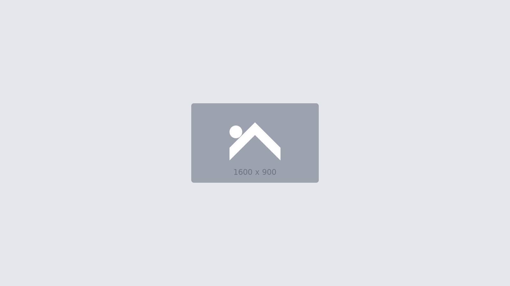
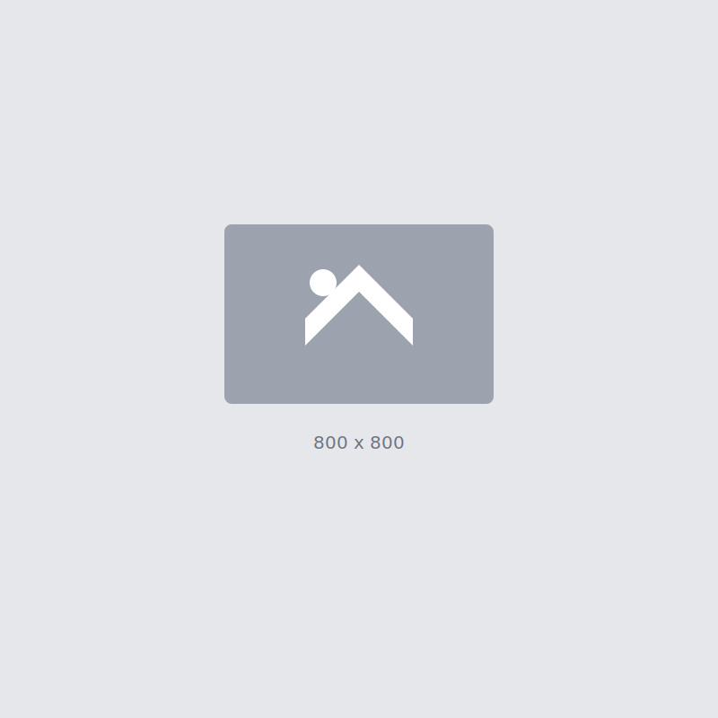

# 🎨 Workshop Assets

This directory contains sample icons and images for use in the Design-to-Code workshop exercises.

## 📁 Directory Structure

```
assets/
├── icons/          # SVG icon files
│   ├── arrow-right.svg
│   ├── close.svg
│   ├── heart.svg
│   ├── menu.svg
│   ├── search.svg
│   └── user.svg
├── images/         # Placeholder images
│   ├── placeholder-16-9.svg
│   └── placeholder-square.svg
└── README.md       # This file
```

## 🎯 Usage

### Icons

All icons are designed as SVG files with `currentColor` for easy color customization:

```html
<!-- In HTML -->


<!-- In React -->
import MenuIcon from './assets/icons/menu.svg';
```

### Icon Properties
- **Size**: 24x24px viewBox
- **Stroke**: Uses `currentColor` for easy theming
- **Stroke Width**: 2px
- **Line Cap/Join**: Round for smooth appearance

### Placeholder Images

The placeholder images can be used during development:

```html
<!-- Card image -->


<!-- Avatar/Profile -->

```

## 🎨 Customization

### Changing Icon Colors

Since icons use `currentColor`, you can style them with CSS:

```css
.icon {
  color: #2196F3; /* Changes the icon color */
}
```

### Creating New Icons

When creating new icons, follow these guidelines:
1. Use a 24x24 viewBox
2. Use `currentColor` for strokes/fills
3. Keep stroke width at 2px
4. Use round line caps and joins
5. Optimize with SVGO if needed

## 📚 Export from Figma

When exporting assets from Figma:

### For Icons (SVG):
1. Select the icon layer
2. Export as SVG
3. Include "id" attribute: No
4. Outline text: Yes
5. Flatten transforms: Yes

### For Images (PNG):
1. Select the image/frame
2. Export as PNG
3. Choose appropriate scale (1x, 2x, 3x)
4. Use transparent background if needed

## 🔧 Optimization

### SVG Optimization
```bash
# Install SVGO
npm install -g svgo

# Optimize a single file
svgo icon.svg -o icon.optimized.svg

# Optimize all icons
svgo -f ./icons -o ./icons
```

### Image Optimization
For PNG images, use tools like:
- TinyPNG
- ImageOptim
- Sharp (Node.js)

## 📝 Notes

- These are sample assets for workshop exercises
- In production, use a proper icon system (icon fonts, sprite sheets, or React components)
- Consider accessibility: always provide appropriate alt text
- For production images, implement lazy loading and responsive images 